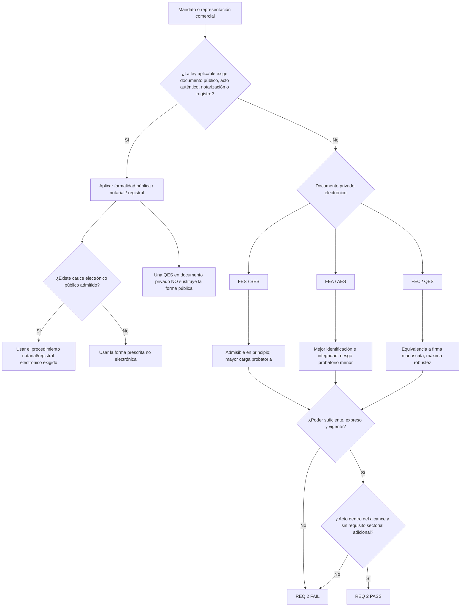

# Evidencia regulatoria para Block 3 — P10 FR/ES y marco de 33 jurisdicciones

## Resumen ejecutivo

**Conclusión principal para P10:** en Francia y España, eIDAS regula el efecto jurídico y la robustez probatoria de la firma electrónica, pero **no sustituye las reglas nacionales sobre existencia, alcance, forma pública, suficiencia de poderes o publicidad registral de la representación**. Una firma electrónica cualificada —FEC/QES— tiene el mismo efecto jurídico que una firma manuscrita, y una firma electrónica no puede ser privada de efectos jurídicos o de admisibilidad como prueba únicamente por ser electrónica o por no ser cualificada. Sin embargo, una QES aplicada a un PDF privado **no transforma ese documento en escritura pública o acto auténtico** cuando la ley nacional exige intervención notarial u otra forma pública. Esta separación entre «validez/efecto de la firma» y «validez/forma del poder» es el gate decisivo para Req 2. citeturn5search6turn14search7turn19search21turn16view0

A fecha de **13 de agosto de 2026**, EUR-Lex identifica como versión consolidada actual del Reglamento eIDAS la de 18 de octubre de 2024, incorporando la reforma de eIDAS por el Reglamento (UE) 2024/1183. El artículo 25 mantiene el principio de no discriminación de la firma electrónica y la equivalencia de la firma electrónica cualificada con la manuscrita; el artículo 26 establece los requisitos de la firma electrónica avanzada. citeturn14search7turn14search8turn14search11

Para **Francia**, el punto de partida es especialmente flexible: el mandato puede otorgarse por acto auténtico, documento privado, incluso carta, y también verbalmente; además, la aceptación del mandatario puede ser tácita. Para actos de disposición —enajenar, hipotecar u otros actos de propiedad— el poder debe ser **expreso**. El documento electrónico tiene la misma fuerza probatoria que el papel si se identifica debidamente a su emisor y se preserva su integridad; la firma electrónica debe utilizar un proceso fiable de identificación ligado al acto. Francia reserva la **presunción legal de fiabilidad** del proceso de firma a la QES conforme al Decreto n.º 2017-1416. citeturn14search15turn19search2turn19search25turn14search5turn20view0

Por ello, para un **mandato comercial privado ordinario francés**, una FES/SES o FEA/AES no queda excluida jurídicamente y puede ser suficiente si la evidencia permite probar identidad, consentimiento, vínculo con el documento e integridad; una QES es, no obstante, el estándar de menor riesgo porque añade la equivalencia eIDAS a la firma manuscrita y la presunción francesa de fiabilidad. Cuando el negocio subyacente requiera acto auténtico, debe utilizarse el procedimiento de acto auténtico, que Francia admite también en soporte electrónico; una QES privada por sí sola no satisface ese requisito. Esta conclusión es una inferencia jurídica de los artículos 1174, 1366, 1367, 1369, 1985 y 1988 del Code civil y del Decreto 2017-1416. citeturn19search21turn19search16turn19search25turn14search5turn14search15turn19search2turn20view0

Para **España**, el mandato es también inicialmente antiformalista: puede ser expreso o tácito, y el expreso puede otorgarse mediante instrumento público, privado o incluso de palabra; la aceptación puede ser expresa o tácita. No obstante, el artículo 1713 exige mandato **expreso** para transigir, enajenar, hipotecar o realizar otros actos de riguroso dominio, y el artículo 1280.5 dispone que deben constar en documento público, entre otros, el poder para administrar bienes y cualquier poder relativo a un acto que se formalice o deba formalizarse en escritura pública o que haya de perjudicar a tercero. Debe leerse este último precepto conjuntamente con los artículos 1278 y 1279: la exigencia de documento público **no es automáticamente constitutiva de validez en todos los supuestos**, pero sí constituye un gate operativo muy relevante para la plena eficacia, acreditación y utilización notarial/registral del poder, salvo que otra norma establezca solemnidad constitutiva. citeturn15search2turn16view0

En España, además, los **poderes generales societarios y delegaciones de facultades** son de inscripción obligatoria en la hoja de la sociedad conforme al artículo 94.1.5.º del Reglamento del Registro Mercantil, excepto los poderes generales para pleitos y los otorgados para actos concretos. La doctrina oficial de la Dirección General de Seguridad Jurídica y Fe Pública matiza que esa inscripción no es, con carácter general, constitutiva de la existencia del poder ni necesariamente debe preceder a todo acto posterior, pero la ausencia de publicidad incrementa sustancialmente la carga de probar la existencia, validez, vigencia y suficiencia de la representación y puede limitar su plena eficacia frente a terceros. citeturn16view1turn22search0turn22search1turn22search10

**Recomendación de política V2:** para mandatos comerciales privados que no estén sometidos a forma pública, fijaría **FEA/AES como mínimo operativo y FEC/QES como estándar preferido**, haciendo obligatoria QES en operaciones transfronterizas, de alto valor o con riesgo elevado de impugnación de autoridad. Pero añadiría un **public-form override**: si la ley del país o la operación requiere escritura/documento público, acto auténtico, notarización o registro, la ruta privada de firma electrónica queda bloqueada con independencia de que sea FES, FEA o FEC. Esta es una recomendación de control de riesgo, no una afirmación de que FEA o QES sean siempre mínimos legales. citeturn5search6turn20view0turn19search21turn16view0turn15search0

La lista nominal de las **33 jurisdicciones no se ha proporcionado**. Conforme a la instrucción recibida, no asigno arbitrariamente 31 países ni presumo que sean los 27 Estados de la UE más otros mercados: FR y ES se investigan en profundidad y las otras 31 posiciones quedan marcadas como **«país no especificado»**. Sin conocer cada jurisdicción no es jurídicamente defendible atribuirle eIDAS, una ley nacional de mandato, requisitos notariales o reglas registrales concretas.

## Marco eIDAS y criterio de aceptación

### Qué significan FES, FEA y FEC para Block 3

En la terminología operativa del informe:

| Nivel | Significado para Block 3 | Efecto jurídico relevante |
|---|---|---|
| **FES / SES** | «Firma electrónica simple» es una etiqueta práctica para una firma electrónica que no necesariamente alcanza el nivel avanzado. | No puede rechazarse únicamente por ser electrónica o no ser cualificada; su suficiencia probatoria depende del contexto y de la ley nacional. citeturn5search6turn14search11 |
| **FEA / AES** | Firma electrónica avanzada conforme al art. 26 eIDAS. | Debe estar vinculada de manera única al firmante, permitir identificarlo, haber sido creada bajo su control con alto nivel de confianza y quedar vinculada a los datos de forma que alteraciones posteriores sean detectables. No obtiene, por el mero art. 25, equivalencia automática con la manuscrita. citeturn5search6 |
| **FEC / QES** | FEA que además utiliza dispositivo cualificado y certificado cualificado conforme a eIDAS. | Tiene el mismo efecto jurídico que la firma manuscrita. Una QES basada en certificado cualificado emitido en un Estado miembro debe ser reconocida como QES en los demás Estados miembros. citeturn5search6turn20view0 |

El error que debe evitar Block 3 es convertir esa jerarquía en una regla del tipo **«QES = documento siempre válido»**. eIDAS protege el efecto de la firma, pero la naturaleza jurídica y el valor del documento siguen sujetos a las reglas aplicables al acto: España lo expresa de forma particularmente clara en el artículo 3.1 de la Ley 6/2020, según el cual los documentos electrónicos públicos, administrativos y privados tienen el valor y eficacia que corresponda a su respectiva naturaleza conforme a la legislación aplicable. citeturn17view0

España también distingue expresamente el régimen probatorio de servicios de confianza cualificados y no cualificados. Bajo el artículo 326.3 de la Ley de Enjuiciamiento Civil, un documento electrónico sustentado en un servicio no cualificado, si se discute su autenticidad, integridad, fecha u otras características, se somete al régimen probatorio ordinario y a eIDAS; con un servicio cualificado, el artículo 326.4 presume que la característica discutida concurre y que el servicio se prestó correctamente si constaba en la lista de confianza, desplazando la carga de la comprobación al impugnante. citeturn15search0turn17view0

Francia llega a una solución comparable por otra vía: el artículo 1366 del Code civil equipara probatoriamente escrito electrónico y escrito en papel siempre que se identifique al emisor y se garantice la integridad; el artículo 1367 exige un procedimiento fiable de identificación vinculado al acto, y el artículo 1 del Decreto 2017-1416 presume la fiabilidad cuando el proceso implementa una **signature électronique qualifiée**. citeturn19search25turn14search5turn20view0

### Árbol de decisión recomendado para Req 2

El árbol refleja dos gates independientes: primero, **forma del mandato/acto**; segundo, **autenticidad y fuerza de la firma**. En Francia, los artículos 1174 y 1369 preservan específicamente el requisito de acto auténtico aunque la contratación pueda ser electrónica; en España, los artículos 1278-1280 y las reglas notariales/registrales hacen igualmente imposible tratar una firma privada cualificada como sustituto universal de la forma pública. citeturn19search21turn19search16turn16view0turn22search5

## Francia — evidencia para P10 y wording V2

### Régimen de mandato y representación

El **artículo 1984 Code civil** define el mandato/procuration como el acto mediante el cual una persona da a otra el poder de hacer algo **para el mandante y en su nombre**, y establece que el contrato solo se forma con la aceptación del mandatario. El **artículo 1985** permite otorgarlo por acto auténtico, acto privado, incluso por carta, o verbalmente; la aceptación puede resultar tácitamente de la ejecución del mandato. Esto significa que, para un mandato comercial privado ordinario, Francia no impone como regla general ni escritura notarial ni siquiera forma escrita. citeturn14search15

El **artículo 1988** limita un mandato redactado en términos generales a los actos de administración y exige poder expreso para enajenar, hipotecar u otros actos de propiedad. Esta exigencia debe traducirse en V2 en una enumeración suficientemente precisa de cualquier poder de disposición; una cláusula genérica tipo «tous pouvoirs» es una base de riesgo si se pretende cubrir operaciones dispositivas. citeturn19search2

El mandatario no debe actuar más allá de los poderes concedidos, y el principal queda vinculado por los compromisos asumidos por el mandatario dentro del mandato; lo realizado más allá de éste necesita ratificación del principal. Por ello, la delimitación de objeto, actos permitidos, límites y posibles facultades de sustitución es material para Req 2, no mero drafting cosmético. citeturn1search7turn1search4

Cuando la relación no sea un poder aislado sino una **agencia comercial permanente e independiente**, entra en juego el Code de commerce. El artículo L134-1 considera agent commercial al mandatario independiente encargado de manera permanente de negociar y, eventualmente, concluir contratos en nombre y por cuenta de sus principales; el agente debe inscribirse en el registro especial de agentes comerciales. El mismo artículo excluye de este régimen las actividades cuya misión representativa esté regulada por disposiciones legislativas especiales. El artículo L134-2 concede a cualquiera de las partes el derecho a obtener de la otra un escrito firmado que recoja el contenido del contrato de agencia y sus modificaciones. citeturn21search1turn21search6

### Firma electrónica y suficiencia por nivel

| Nivel en un mandato privado FR | Resultado para P10 | Fundamento |
|---|---|---|
| **FES / SES** | **Admisible con riesgo probatorio — Ámbar.** No existe prohibición general; dado que art. 1985 permite incluso mandato verbal, una firma simple puede evidenciar un mandato. Pero debe poder probarse identidad, consentimiento y vínculo con el documento; no goza de la presunción francesa reservada a QES. | eIDAS art. 25; CC arts. 1366-1367 y 1985. citeturn5search6turn19search25turn14search5turn14search15 |
| **FEA / AES** | **Admisible — Ámbar/Verde.** Mejor encaje técnico con identificación, control e integridad, pero Francia no le concede por sí sola la presunción del Decreto 2017-1416. | eIDAS art. 26; CC art. 1367; Decreto 2017-1416 art. 1. citeturn5search6turn14search5turn20view0 |
| **FEC / QES** | **Sí — Verde.** Equivalente a manuscrita por eIDAS y el procedimiento de firma disfruta en Francia de presunción de fiabilidad, salvo prueba en contrario. | eIDAS art. 25.2; Decreto 2017-1416 art. 1. citeturn5search6turn20view0 |
| **Cualquier nivel sobre PDF privado cuando se exige acto auténtico** | **No suficiente — Rojo.** Debe satisfacerse el procedimiento de acto auténtico; éste puede ser electrónico, pero requiere las solemnidades y al oficial público competente. | CC arts. 1174 y 1369. citeturn19search21turn19search16 |

No se identifica en el derecho francés vigente una categoría nacional general de firma que sustituya a la clasificación eIDAS. El elemento nacional especialmente relevante para P10 es, más bien, **la presunción de fiabilidad de la QES** establecida por el Decreto 2017-1416 en desarrollo del artículo 1367. citeturn20view0

### Elementos requeridos o materialmente necesarios en V2 FR

No existe una fórmula sacramental general para un mandato privado francés, porque la propia ley permite incluso su otorgamiento verbal; los requisitos de drafting se derivan, por tanto, de la necesidad de acreditar los elementos legales del mandato y de limitar el riesgo de exceso de poder. Como mínimo operativo, V2 debería identificar de forma inequívoca al **mandant** y al **mandataire**, declarar que éste actúa **au nom et pour le compte** del mandante, definir el objeto y las facultades, incluir expresamente todo acto dispositivo comprendido en art. 1988 y documentar la aceptación. Para una versión digital deben añadirse elementos suficientes para atribuir la firma al signatario y preservar la integridad del instrumento. citeturn14search15turn19search2turn19search25turn14search5

Como controles de V2 —aunque no todos constituyen palabras legalmente obligatorias— conviene incorporar la capacidad/cargo del firmante del mandante, fecha de efecto, fecha o evento de expiración, regla sobre sustitución, límites cuantitativos o de operación cuando existan y referencia expresa a revocación. Estos elementos reducen el riesgo de que el tercero no pueda determinar alcance o vigencia; la necesidad de no exceder el mandato deriva directamente del régimen de los artículos 1988-1989. citeturn19search2turn1search7

**Wording V2 propuesto — Francia:**

> **«[Dénomination du mandant]**, [forme sociale], immatriculée sous le numéro [●], ayant son siège social à [●], représentée par **[nom, fonction]**, dûment habilité(e) aux fins des présentes, **donne pouvoir à [nom / identification du mandataire] d’agir en son nom et pour son compte**, exclusivement afin de **[décrire précisément les actes et opérations autorisés]**.  
>
> Sont notamment et expressément autorisés, lorsque cela est applicable, les actes suivants : **[énumérer expressément tout acte d’aliénation, d’hypothèque ou autre acte de disposition/propriété]**. Le mandataire ne pourra agir au-delà des pouvoirs expressément conférés par le présent mandat.  
>
> **[La substitution est autorisée uniquement dans les conditions suivantes : ● / Toute substitution est interdite.]** Le présent mandat prend effet le [●] et demeure valable jusqu’au [● / événement], sous réserve de toute révocation valable.  
>
> **Le mandataire accepte le présent mandat.**  
>
> Signé le [●] par [nom], agissant pour le compte de [mandant], au moyen d’une **[signature électronique avancée / signature électronique qualifiée]** conformément au règlement (UE) n° 910/2014.»

La expresión «en su nombre» proviene directamente del artículo 1984; la aceptación responde a los artículos 1984-1985; la enumeración de actos de disposición responde al artículo 1988, y la cláusula que prohíbe exceder las facultades refleja el artículo 1989. La referencia al nivel de firma no es necesaria para crear el mandato, pero mejora la trazabilidad de Block 3. citeturn14search15turn19search2turn1search7

**Rider de forma pública recomendado:**

> «Lorsque la loi applicable à l’acte concerné exige un acte authentique, une formalité notariale, une inscription ou toute autre formalité obligatoire, les pouvoirs correspondants ne pourront être exercés qu’après accomplissement de cette formalité.»

Este rider no «cura» la falta de forma; su función es impedir que V2 sea interpretado como autorización para utilizar el documento privado cuando el acto requiere forma auténtica. El fundamento está en los artículos 1174 y 1369. citeturn19search21turn19search16

### Texto listo para celda P10 — FR

> **FR — PASS condicionado.** El mandato/procuration puede otorgarse por acto auténtico, documento privado —incluso carta— o verbalmente y la aceptación puede ser tácita (Code civil arts. 1984-1985). Un mandato general solo comprende actos de administración; enajenación, hipoteca u otros actos de propiedad requieren poder expreso (art. 1988). El escrito electrónico tiene la misma fuerza probatoria que el papel si se identifica al emisor y se preserva la integridad (art. 1366); la firma electrónica debe usar un procedimiento fiable ligado al acto (art. 1367). FES/FEA no se excluyen para un mandato privado ordinario, pero soportan mayor riesgo probatorio; FEC/QES equivale a firma manuscrita bajo eIDAS art. 25.2 y obtiene en Francia presunción de fiabilidad bajo Décret n° 2017-1416 art. 1. Si el acto requiere **acte authentique**, una QES privada no es suficiente: debe cumplirse la forma auténtica, incluida la modalidad electrónica prevista por arts. 1174 y 1369. Para agencia comercial permanente pueden aplicar Code de commerce L134-1/L134-2 y registro especial del agente. citeturn14search15turn19search2turn19search25turn14search5turn20view0turn19search21turn19search16turn21search1turn21search6

## España — evidencia para P10 y wording V2

### Mandato, representación societaria y forma documental

El **artículo 1709 Código Civil** configura el mandato como la obligación de prestar un servicio o hacer algo por cuenta o encargo de otro. El **artículo 1710** permite mandato expreso o tácito y establece que el expreso puede darse mediante instrumento público, privado o de palabra, mientras que la aceptación puede ser expresa o tácita. Los artículos 1712-1714 distinguen mandato general y especial, limitan el mandato general a actos de administración y exigen poder expreso para transigir, enajenar, hipotecar u otros actos de riguroso dominio; el mandatario no puede traspasar sus límites. citeturn15search2

La principal diferencia operacional respecto de Francia es el **artículo 1280.5 Código Civil**, que dispone que deben constar en documento público el poder para contraer matrimonio, el general para pleitos y los especiales que deban presentarse en juicio, el poder para administrar bienes y cualquier otro poder que tenga por objeto un acto formalizado o que deba formalizarse en escritura pública o que haya de perjudicar a tercero. Sin embargo, los artículos 1278 y 1279 establecen simultáneamente el principio general de obligatoriedad de los contratos cualquiera que sea su forma y el derecho de las partes a compelerse a cumplir la forma especial legalmente exigida. Por ello, para Block 3 el artículo 1280.5 debe tratarse como un **hard gate documental/operativo**, sin afirmar de manera excesivamente amplia que toda infracción formal produce nulidad civil automática. citeturn16view0

En una sociedad de capital, no todo acto representativo requiere un poder separado. El artículo 233 de la Ley de Sociedades de Capital atribuye la representación a los administradores según la estructura del órgano —administrador único, solidarios, mancomunados o consejo— y el artículo 234 extiende el poder representativo a los actos comprendidos en el objeto social, estableciendo además protección frente a terceros de buena fe en los términos del precepto. Block 3 debe, por ello, distinguir entre **representación orgánica** del administrador y **representación voluntaria** del apoderado. citeturn18view0turn18view1

Para poderes voluntarios societarios, el artículo 94.1.5.º del Reglamento del Registro Mercantil establece la inscripción obligatoria de poderes generales y delegaciones de facultades, modificaciones, revocaciones y sustituciones, con excepción de los poderes generales para pleitos y los concedidos para actos concretos. La DGSJFP ha reiterado que esa publicidad no convierte la inscripción, con carácter general, en condición constitutiva de la existencia del poder; cuando no esté inscrito, sin embargo, debe acreditarse rigurosamente la legalidad, existencia, vigencia y suficiencia de la representación. citeturn16view1turn22search0turn22search1

La doctrina notarial/registral añade un gate muy práctico: bajo el artículo 98 de la Ley 24/2001, cuando un representante comparece en instrumento público, el notario debe reseñar el documento auténtico del que nace la representación y emitir juicio de suficiencia congruente con el negocio. En poderes societarios no inscritos, la doctrina oficial exige un examen particularmente riguroso de existencia y vigencia; una firma electrónica válida del apoderado no reemplaza este análisis de suficiencia. citeturn22search1turn22search5turn22search9

### eIDAS, Ley 6/2020 y firma del representante

La Ley 6/2020 española parte expresamente de que eIDAS es de aplicación directa y complementa únicamente los aspectos no armonizados. Su preámbulo confirma la equivalencia jurídica de la firma electrónica cualificada con la manuscrita y explica que el legislador español confiere una ventaja probatoria a los servicios de confianza cualificados. La ley derogó el régimen anterior de la Ley 59/2003; bajo el paradigma eIDAS, las personas jurídicas utilizan sellos electrónicos, mientras que pueden actuar mediante la firma electrónica de las personas físicas que legalmente las representen. citeturn17view0

Para Block 3 es especialmente relevante que los certificados que incorporen una **relación de representación** deben identificar al representado y referirse al documento que acredite fehacientemente las facultades, **público si resulta exigible**, y a los datos registrales cuando la inscripción sea obligatoria. Los prestadores que emitan certificados cualificados con atributo de representante deben comprobar extensión y vigencia de las facultades y la inscripción en registro público cuando sea legalmente exigible. Además, la terminación de la representación obliga a solicitar la revocación del certificado con atributo de representante. citeturn17view0

Esto confirma un principio esencial para Req 2: **un certificado de representante y una QES son evidencia de identidad/atribución, no una fuente autónoma de facultades representativas**. Las facultades deben existir, estar vigentes y cumplir la forma y publicidad que correspondan. citeturn17view0turn22search5

### Suficiencia por nivel en España

| Nivel en mandato privado ES | Resultado para P10 | Fundamento |
|---|---|---|
| **FES / SES** | **Admisible con riesgo — Ámbar.** eIDAS impide descartarla únicamente por no ser cualificada. Si la autenticidad de un documento electrónico sustentado en servicio no cualificado se impugna, opera el régimen probatorio de LEC 326.2-3. | eIDAS art. 25.1; LEC art. 326. citeturn5search6turn15search0 |
| **FEA / AES** | **Admisible para mandato privado ordinario — Ámbar/Verde**, siempre que no exista requisito de forma pública. Aporta las garantías técnicas del art. 26 eIDAS, pero no obtiene por ello la equivalencia automática con la manuscrita que corresponde a QES. | eIDAS arts. 25-26; Ley 6/2020 art. 3. citeturn5search6turn17view0 |
| **FEC / QES** | **Sí — Verde** para satisfacer un requisito de firma manuscrita en un documento privado; equivale jurídicamente a ésta. El uso de servicios cualificados obtiene además el régimen probatorio reforzado del art. 326.4 LEC. | eIDAS art. 25.2; LEC art. 326.4. citeturn5search6turn15search0 |
| **FES/FEA/FEC sobre documento privado si la operación requiere documento público** | **No suficiente para el gate público — Rojo.** La QES no convierte el documento privado en instrumento público ni sustituye al notario. | CC arts. 1278-1280; Ley 6/2020 art. 3 y DA 1.ª; doctrina notarial/registral. citeturn16view0turn17view0turn22search5 |

Por tanto, tampoco en España debe configurarse un «equivalente nacional» autónomo que compita con eIDAS. La actual Ley 6/2020 complementa eIDAS y refuerza especialmente la **prueba** de los servicios cualificados, la comprobación de los atributos representativos y la revocación de certificados. citeturn17view0turn15search0

### Reglas especiales de agencia mercantil

Cuando la relación V2 sea realmente una **agencia estable** y no un poder puntual, la Ley 12/1992 sobre Contrato de Agencia es relevante. Su artículo 1 cubre al agente independiente que, de forma continuada o estable, promueve operaciones por cuenta ajena o las promueve y concluye por cuenta y en nombre ajenos. Conforme al artículo 6, el agente puede promover las operaciones objeto del contrato, pero solo puede **concluirlas en nombre del empresario si se le ha atribuido expresamente esa facultad**. citeturn18view2turn18view3

La propia Ley 12/1992 contiene formalidades sectoriales/contractuales específicas: la utilización de subagentes requiere autorización expresa del empresario; el pacto por el que el agente asume el riesgo de operaciones es nulo si no consta por escrito y expresa la comisión; una limitación poscontractual de competencia debe constar por escrito para su validez; y cualquiera de las partes puede exigir la formalización escrita del contrato de agencia. Los agentes que actúan en mercados secundarios oficiales o reglamentados de valores están excluidos de la ley. citeturn18view2

### Elementos requeridos o materialmente necesarios en V2 ES

V2 debería identificar al poderdante y al apoderado, la capacidad/cargo de quien firma por la entidad, declarar de forma inequívoca que el apoderado actúa **en nombre y por cuenta** del poderdante, describir los negocios autorizados y enumerar expresamente las facultades de transigir, enajenar, hipotecar u otros actos de riguroso dominio cuando se pretendan conceder. La necesidad de no exceder el alcance debe reflejar el artículo 1714. citeturn15search2

Para representación societaria, el workflow debería conservar la evidencia del órgano/cargo del otorgante y determinar si se está usando representación orgánica bajo LSC 233 o un poder voluntario. Si se trata de poder general societario, debe activarse la comprobación de RRM 94.1.5; si es para un acto concreto, la excepción registral de ese precepto evita imponer automáticamente la inscripción del poder, aunque el acto puede seguir necesitando documento público por el artículo 1280.5 u otra norma. citeturn18view0turn16view1turn16view0

**Wording V2 propuesto — España:**

> **«[Denominación del poderdante]**, [forma social], con NIF [●] y domicilio en [●], representada en este acto por **[nombre, cargo]**, quien declara disponer de facultades suficientes y vigentes para este otorgamiento, **confiere mandato/poder a [nombre e identificación del apoderado] para actuar en nombre y por cuenta del poderdante**, exclusivamente respecto de **[describir con precisión los actos, operaciones y límites]**.  
>
> Cuando resulte aplicable, se confieren **expresamente** las siguientes facultades: **[transigir / enajenar / hipotecar / realizar los siguientes actos de riguroso dominio: ●]**. El apoderado no podrá exceder las facultades expresamente atribuidas.  
>
> **[La sustitución queda autorizada exclusivamente en los siguientes términos: ● / Queda prohibida la sustitución.]** El presente poder entrará en vigor el [●] y permanecerá vigente hasta [● / evento], salvo revocación anterior válida.  
>
> **El apoderado acepta el mandato.**  
>
> Firmado electrónicamente el [●] por [nombre], en representación de [poderdante], mediante **[firma electrónica avanzada / firma electrónica cualificada]**, conforme al Reglamento (UE) n.º 910/2014.»

Los elementos esenciales de alcance y poder expreso se apoyan en los artículos 1710-1714; la identificación del cargo y facultades del representante societario debe verificarse frente a los artículos 233-234 LSC y, cuando proceda, al Registro Mercantil. citeturn15search2turn18view0turn18view1

**Rider de forma pública V2 recomendado para España:**

> «Cuando la ley aplicable al acto o a las facultades conferidas exija escritura o documento público, intervención notarial, inscripción registral u otra formalidad obligatoria, las facultades afectadas solo podrán ejercitarse una vez cumplida dicha formalidad, sin que la firma electrónica del presente documento privado sustituya por sí sola la forma pública exigible.»

Este rider refleja la combinación de los artículos 1278-1280 CC, la Ley 6/2020 y la doctrina registral sobre acreditación y suficiencia del poder. No convierte el documento en público ni debe presentarse como sustitución de la actuación notarial. citeturn16view0turn17view0turn22search5

### Texto listo para celda P10 — ES

> **ES — PASS condicionado / hard gate de forma pública.** El mandato puede ser expreso o tácito y el expreso puede otorgarse por instrumento público, privado o verbalmente; su aceptación puede ser expresa o tácita (CC arts. 1709-1710). Un mandato general solo cubre administración; transigir, enajenar, hipotecar u otros actos de riguroso dominio requieren mandato expreso (art. 1713) y el mandatario no puede exceder sus límites (art. 1714). El art. 1280.5 exige documento público para poder de administración de bienes y poderes relativos a actos que deban constar en escritura pública o perjudicar a terceros, leído con arts. 1278-1279; por tanto, una FES/FEA/FEC aplicada a un documento privado no sustituye el instrumento público cuando éste sea exigible. FEC/QES equivale a firma manuscrita conforme eIDAS art. 25.2; los servicios cualificados disfrutan del régimen probatorio reforzado de LEC art. 326.4, mientras los no cualificados se someten a art. 326.3. Los poderes generales societarios son de inscripción obligatoria conforme RRM art. 94.1.5.º —excepto poderes generales para pleitos y poderes para actos concretos—, aunque la inscripción no sea con carácter general constitutiva de la existencia del poder; la falta de inscripción eleva la carga de acreditar existencia, vigencia y suficiencia. citeturn15search2turn16view0turn5search6turn15search0turn16view1turn22search0turn22search1

## Matriz consolidada de las 33 jurisdicciones

La matriz preserva exactamente 33 posiciones. **Solo FR y ES pueden completarse responsablemente con la información disponible**; las otras 31 posiciones permanecen como «no especificadas». En particular, no se marca eIDAS «sí» para una jurisdicción desconocida, porque podría tratarse de un tercer país con un régimen completamente diferente.

| Pos. | País | Leyes / citas aplicables | eIDAS y nivel aceptable | Reglas nacionales de firma | Formalidades del mandato / representación | Nota para wording V2 |
|---:|---|---|---|---|---|---|
| 1 | **Francia (FR)** | Code civil arts. **1984, 1985, 1988, 1989, 1174, 1366, 1367, 1369**; Décret **2017-1416 art. 1**; Code de commerce **L134-1/L134-2** para agencia. citeturn14search15turn19search2turn19search21turn19search25turn14search5turn19search16turn20view0turn21search1turn21search6 | **Sí.** FES: admisible con prueba; FEA: admisible; FEC/QES: equivalente a manuscrita y mejor posición probatoria. citeturn5search6turn20view0 | QES obtiene **presunción de fiabilidad** del proceso bajo Decreto 2017-1416. citeturn20view0 | Mandato ordinario: sin notarización general; puede ser privado o incluso verbal. Actos de propiedad/disposición: poder **expreso**. Si acto auténtico exigido: cumplir forma auténtica. Agencia comercial permanente: registro especial. citeturn14search15turn19search2turn19search16turn21search1 | V2 debe usar «**au nom et pour le compte**», alcance preciso, facultades dispositivas expresas, aceptación y public-form override. |
| 2 | **España (ES)** | CC arts. **1278-1280, 1709-1714**; Ley **6/2020**; LEC **326**; LSC **233-234**; RRM **94.1.5.º**; Ley **12/1992** arts. 1, 3, 5, 6, 19, 21, 22. citeturn16view0turn15search2turn17view0turn15search0turn18view0turn16view1turn18view2 | **Sí.** FES/FEA posibles para documento privado; FEC/QES = manuscrita. Ninguna firma privada sustituye documento público cuando sea exigible. citeturn5search6turn17view0turn16view0 | Servicio cualificado: presunción probatoria LEC 326.4. Certificado con atributo de representante debe reflejar/acreditar poder y datos registrales cuando sean exigibles. citeturn15search0turn17view0 | Poder expreso para actos de riguroso dominio. Art. 1280.5 activa documento público en los casos previstos. Poder general societario: inscripción obligatoria RRM 94.1.5.º, con excepciones indicadas y sin general carácter constitutivo. citeturn15search2turn16view0turn16view1turn22search0 | V2: «**en nombre y por cuenta**», actos dispositivos expresos, comprobar representación orgánica/poder, public-form + registry override. |
| 3 | **País no especificado 03** | No determinable sin jurisdicción. | No determinable. | No determinable. | No determinable. | **Pendiente de country mapping.** No reutilizar automáticamente conclusión FR/ES. |
| 4 | **País no especificado 04** | No determinable sin jurisdicción. | No determinable. | No determinable. | No determinable. | Pendiente de country mapping. |
| 5 | **País no especificado 05** | No determinable sin jurisdicción. | No determinable. | No determinable. | No determinable. | Pendiente de country mapping. |
| 6 | **País no especificado 06** | No determinable sin jurisdicción. | No determinable. | No determinable. | No determinable. | Pendiente de country mapping. |
| 7 | **País no especificado 07** | No determinable sin jurisdicción. | No determinable. | No determinable. | No determinable. | Pendiente de country mapping. |
| 8 | **País no especificado 08** | No determinable sin jurisdicción. | No determinable. | No determinable. | No determinable. | Pendiente de country mapping. |
| 9 | **País no especificado 09** | No determinable sin jurisdicción. | No determinable. | No determinable. | No determinable. | Pendiente de country mapping. |
| 10 | **País no especificado 10** | No determinable sin jurisdicción. | No determinable. | No determinable. | No determinable. | Pendiente de country mapping. |
| 11 | **País no especificado 11** | No determinable sin jurisdicción. | No determinable. | No determinable. | No determinable. | Pendiente de country mapping. |
| 12 | **País no especificado 12** | No determinable sin jurisdicción. | No determinable. | No determinable. | No determinable. | Pendiente de country mapping. |
| 13 | **País no especificado 13** | No determinable sin jurisdicción. | No determinable. | No determinable. | No determinable. | Pendiente de country mapping. |
| 14 | **País no especificado 14** | No determinable sin jurisdicción. | No determinable. | No determinable. | No determinable. | Pendiente de country mapping. |
| 15 | **País no especificado 15** | No determinable sin jurisdicción. | No determinable. | No determinable. | No determinable. | Pendiente de country mapping. |
| 16 | **País no especificado 16** | No determinable sin jurisdicción. | No determinable. | No determinable. | No determinable. | Pendiente de country mapping. |
| 17 | **País no especificado 17** | No determinable sin jurisdicción. | No determinable. | No determinable. | No determinable. | Pendiente de country mapping. |
| 18 | **País no especificado 18** | No determinable sin jurisdicción. | No determinable. | No determinable. | No determinable. | Pendiente de country mapping. |
| 19 | **País no especificado 19** | No determinable sin jurisdicción. | No determinable. | No determinable. | No determinable. | Pendiente de country mapping. |
| 20 | **País no especificado 20** | No determinable sin jurisdicción. | No determinable. | No determinable. | No determinable. | Pendiente de country mapping. |
| 21 | **País no especificado 21** | No determinable sin jurisdicción. | No determinable. | No determinable. | No determinable. | Pendiente de country mapping. |
| 22 | **País no especificado 22** | No determinable sin jurisdicción. | No determinable. | No determinable. | No determinable. | Pendiente de country mapping. |
| 23 | **País no especificado 23** | No determinable sin jurisdicción. | No determinable. | No determinable. | No determinable. | Pendiente de country mapping. |
| 24 | **País no especificado 24** | No determinable sin jurisdicción. | No determinable. | No determinable. | No determinable. | Pendiente de country mapping. |
| 25 | **País no especificado 25** | No determinable sin jurisdicción. | No determinable. | No determinable. | No determinable. | Pendiente de country mapping. |
| 26 | **País no especificado 26** | No determinable sin jurisdicción. | No determinable. | No determinable. | No determinable. | Pendiente de country mapping. |
| 27 | **País no especificado 27** | No determinable sin jurisdicción. | No determinable. | No determinable. | No determinable. | Pendiente de country mapping. |
| 28 | **País no especificado 28** | No determinable sin jurisdicción. | No determinable. | No determinable. | No determinable. | Pendiente de country mapping. |
| 29 | **País no especificado 29** | No determinable sin jurisdicción. | No determinable. | No determinable. | No determinable. | Pendiente de country mapping. |
| 30 | **País no especificado 30** | No determinable sin jurisdicción. | No determinable. | No determinable. | No determinable. | Pendiente de country mapping. |
| 31 | **País no especificado 31** | No determinable sin jurisdicción. | No determinable. | No determinable. | No determinable. | Pendiente de country mapping. |
| 32 | **País no especificado 32** | No determinable sin jurisdicción. | No determinable. | No determinable. | No determinable. | Pendiente de country mapping. |
| 33 | **País no especificado 33** | No determinable sin jurisdicción. | No determinable. | No determinable. | No determinable. | Pendiente de country mapping. |

La columna «niveles aceptados» debe entenderse como **suficiencia para un mandato privado en ausencia de una formalidad superior**, no como una conclusión de que cualquier negocio puede celebrarse válidamente con ese nivel de firma. Esta distinción es exigida por la interacción entre eIDAS y las reglas nacionales sobre documento público/acto auténtico. citeturn5search6turn19search21turn19search16turn16view0turn17view0

## Gates de Req 2 y recomendación de compliance V2

Dado que no se ha facilitado el texto interno de «Req 2», el análisis presupone que Req 2 pretende responder a la pregunta operacional: **«¿Existe un mandato/representación jurídicamente atribuible al representado, con facultades suficientes y una firma/formalización aceptable para la operación?»**. Bajo ese supuesto, un único gate «signature valid = yes/no» sería insuficiente.

La lógica de producción debería comprobar sucesivamente: **naturaleza de la representación → autoridad del otorgante → alcance del poder → forma exigida → publicidad/registro → nivel y validación de firma → vigencia/revocación → regla sectorial**. En Francia, la necesidad de poder expreso para actos dispositivos y la separación entre documento privado y auténtico justifican esa secuencia; en España, la misma arquitectura viene reforzada por los artículos 1280.5 y 1713, RRM 94.1.5.º, la comprobación notarial de suficiencia y las reglas de certificados de representante de la Ley 6/2020. citeturn19search2turn19search16turn15search2turn16view0turn16view1turn22search5turn17view0

| Gate Req 2 | FR | ES | Tratamiento V2 recomendado |
|---|---|---|---|
| **¿Quién da el poder?** | Verificar que quien firma por el mandante tiene autoridad. | Distinguir administrador con representación orgánica de apoderamiento voluntario; comprobar LSC 233. citeturn18view0 | Incorporar nombre, cargo, entidad y declaración de autoridad; conservar evidencia registral/corporativa. |
| **¿Se actúa en nombre del principal?** | Es elemento definitorio del art. 1984. citeturn14search15 | Debe quedar claro para representación; agencia que concluye contratos requiere facultad atribuida, art. 6 Ley 12/1992. citeturn18view3 | Fórmula expresa «au nom et pour le compte» / «en nombre y por cuenta». |
| **¿El poder es suficientemente específico?** | Actos de propiedad requieren mandato expreso, art. 1988. citeturn19search2 | Transigir/enajenar/hipotecar/riguroso dominio requieren mandato expreso, art. 1713. citeturn15search2 | Enumerar actos de disposición; no confiar en «todos los poderes». |
| **¿Forma pública exigida?** | Si se exige acto auténtico, aplicar arts. 1174/1369. citeturn19search21turn19search16 | Aplicar CC 1280.5 y cualquier solemnidad especial del negocio. citeturn16view0 | **Hard stop** de signing privado. Enrutar a notario/procedimiento público. |
| **¿Registro?** | No hay registro general del mandato ordinario; agent commercial tiene registro especial. citeturn21search1 | Poder general societario: RRM 94.1.5.º; excepciones para pleitos/actos concretos. citeturn16view1 | Comprobación registral condicional según tipo de poder. |
| **FES** | Posible para privado, alto riesgo de prueba. citeturn14search15turn19search25 | Posible para privado, régimen probatorio más débil si impugnada. citeturn15search0 | No usar como estándar de producción para poderes materiales. |
| **FEA** | Posible y técnicamente robusta; sin presunción nacional de QES. citeturn5search6turn20view0 | Posible en documento privado sin formalidad superior. citeturn5search6turn17view0 | **Mínimo operativo recomendado** para bajo/medio riesgo. |
| **FEC/QES** | Manuscrita + presunción francesa de fiabilidad. citeturn5search6turn20view0 | Manuscrita + fuerte posición probatoria cuando se usa servicio cualificado. citeturn5search6turn15search0 | **Default recomendado** para cross-border, alto valor o alta criticidad. |
| **Vigencia** | Incluir duración/revocación y confirmar poder vigente. | Certificado de representante debe revocarse cuando termina representación. citeturn17view0 | Validation timestamp + check de certificado/poder en fecha de firma. |
| **Agencia/sector** | L134-1: registro del agente y exclusión de misiones sometidas a legislación especial. citeturn21search1 | Ley 12/1992: reglas especiales; mercados oficiales/regulados de valores excluidos. citeturn18view2 | Pregunta previa «¿poder puntual o agencia/actividad regulada?» y routing legal específico. |

### Política de firma V2 propuesta

Para una política reutilizable entre jurisdicciones, la formulación más segura no es «QES accepted everywhere», sino:

> **Private Mandate Rule:** cuando la legislación aplicable permita que el poder o mandato conste en documento privado, V2 podrá formalizarse electrónicamente, sujeto a la prueba de identidad, integridad, consentimiento, autoridad y alcance. El estándar operativo será FEA/AES como mínimo y FEC/QES para operaciones de mayor riesgo.

> **Public Form Override:** cuando la legislación aplicable exija documento público, acto auténtico, notarización, intervención de un funcionario público, inscripción constitutiva o cualquier otra solemnidad para el poder o para el acto a ejecutar, ningún nivel de firma electrónica aplicado únicamente a V2 como documento privado se considerará suficiente; se utilizará el procedimiento público/registral legalmente exigido.

La primera regla aprovecha la no discriminación del artículo 25 eIDAS sin convertir las firmas no cualificadas en equivalentes a QES; la segunda preserva expresamente las reglas nacionales de forma de Francia y España. citeturn5search6turn19search21turn19search16turn16view0turn17view0

### Recomendación final para Block 3

**FR puede marcarse «PASS — conditional».** V2 es viable como mandato privado electrónico; FEA es una base operativa razonable y QES la opción jurídicamente más robusta. Deben existir facultades expresas para disposición y el flujo debe escalar a acto auténtico cuando la operación lo requiera. Si la relación constituye agencia comercial permanente, debe activarse el régimen L134-1 y la comprobación del registro de agentes. citeturn14search15turn19search2turn20view0turn19search16turn21search1

**ES debe marcarse «PASS — conditional / PUBLIC-FORM GATE».** V2 privado puede funcionar para mandatos ordinarios, pero el screening del artículo 1280.5 debe producirse **antes** de escoger nivel de firma. Si el poder o el acto requiere documento público, ni siquiera QES sobre V2 privado debe producir un PASS. Para poderes generales societarios debe añadirse el gate RRM 94.1.5.º, teniendo presente que la inscripción obligatoria no equivale en todos los casos a carácter constitutivo, pero su ausencia crea un riesgo real de acreditación y oponibilidad. citeturn16view0turn16view1turn22search0turn22search1

Para las **31 jurisdicciones aún no identificadas**, la única conclusión de compliance defendible es **PENDING / COUNTRY UNSPECIFIED**. Copiar la conclusión de FR o ES a esos países podría producir falsos PASS, especialmente en sistemas donde un poder corporativo, un poder para actos registrables o un mandato mercantil esté sujeto a notarización, apostilla/legalización, inscripción, testigos o estándares de firma distintos de eIDAS.

## Fuentes autoritativas y enlaces

Las fuentes siguientes son **primarias y oficiales**. Para la Unión Europea se ha utilizado EUR-Lex en español. En Francia, la fuente oficial Légifrance publica la legislación francesa en francés; no existe una versión oficial equivalente en castellano de los artículos franceses citados, por lo que las referencias se mantienen en su idioma normativo original. citeturn14search7turn20view0turn17view0

| Jurisdicción | Fuente oficial | Materia | Enlace |
|---|---|---|---|
| UE | EUR-Lex — Reglamento (UE) 910/2014, versión consolidada 18/10/2024 | eIDAS: definiciones, arts. 25-26, QES y reconocimiento transfronterizo. citeturn14search7turn14search8 | https://eur-lex.europa.eu/legal-content/ES/ALL/?uri=CELEX%3A02014R0910-20241018 |
| UE | EUR-Lex — Reglamento (UE) 2024/1183 | Reforma eIDAS / European Digital Identity Framework. citeturn14search7 | https://eur-lex.europa.eu/legal-content/ES/ALL/?uri=CELEX%3A32024R1183 |
| FR | Légifrance — Code civil, arts. 1984-1990 | Naturaleza, forma y alcance del mandat/procuration. citeturn14search15turn19search2 | https://www.legifrance.gouv.fr/codes/id/LEGISCTA000006136404/ |
| FR | Légifrance — Code civil, art. 1366 | Valor probatorio del escrito electrónico. citeturn19search25 | https://www.legifrance.gouv.fr/codes/article_lc/LEGIARTI000032042461 |
| FR | Légifrance — Code civil, art. 1367 | Firma e identificación fiable. citeturn14search5 | https://www.legifrance.gouv.fr/codes/article_lc/LEGIARTI000032042456 |
| FR | Légifrance — Code civil, art. 1174 | Forma electrónica cuando la ley exige escrito; preservación del acto auténtico. citeturn19search21 | https://www.legifrance.gouv.fr/codes/article_lc/LEGIARTI000032041178 |
| FR | Légifrance — Code civil, art. 1369 | Acto auténtico y soporte electrónico. citeturn19search16 | https://www.legifrance.gouv.fr/codes/article_lc/LEGIARTI000032042446 |
| FR | Légifrance — Décret n° 2017-1416 | Presunción de fiabilidad para QES. citeturn20view0 | https://www.legifrance.gouv.fr/loda/id/JORFTEXT000035676246 |
| FR | Légifrance — Code de commerce, L134-1 a L134-17 | Régimen de agent commercial y registro especial. citeturn21search1turn21search6 | https://www.legifrance.gouv.fr/codes/section_lc/LEGITEXT000005634379/LEGISCTA000006146035/ |
| ES | BOE — Código Civil | Arts. 1278-1280 y 1709-1714: forma, mandato y poderes. citeturn15search12turn16view0turn15search2 | https://www.boe.es/eli/es/rd/1889/07/24/(1)/con |
| ES | BOE — Ley 6/2020 | Servicios electrónicos de confianza; documentos electrónicos; certificados con representación. citeturn17view0 | https://www.boe.es/eli/es/l/2020/11/11/6/con |
| ES | BOE — Ley 1/2000 de Enjuiciamiento Civil | Art. 326: prueba de documentos electrónicos cualificados/no cualificados. citeturn15search0 | https://www.boe.es/eli/es/l/2000/01/07/1/con |
| ES | BOE — Reglamento del Registro Mercantil | Arts. 11 y 94; poderes generales y publicidad. citeturn16view1 | https://www.boe.es/buscar/act.php?id=BOE-A-1996-17533 |
| ES | BOE — Ley de Sociedades de Capital | Arts. 233-234: representación orgánica de sociedades de capital. citeturn18view0turn18view1 | https://www.boe.es/buscar/act.php?id=BOE-A-2010-10544 |
| ES | BOE — Ley 12/1992 sobre Contrato de Agencia | Agencia estable, facultad para concluir contratos, formalidades y exclusiones. citeturn18view2turn18view3 | https://www.boe.es/eli/es/l/1992/05/27/12/con |
| ES | BOE — Resolución DGSJFP de 22/05/2023 | Efectos de poder general no inscrito y acreditación de representación. citeturn22search0 | https://www.boe.es/diario_boe/txt.php?id=BOE-A-2023-14395 |
| ES | BOE — Resolución DGSJFP de 04/02/2025 | Juicio notarial de suficiencia, vigencia y poderes especiales/no inscritos. citeturn22search5 | https://www.boe.es/diario_boe/txt.php?id=BOE-A-2025-3507 |
| ES | BOE — Resolución DGSJFP de 02/06/2023 | RRM arts. 11.3 y 94.1.5.º y poderes generales. citeturn22search10 | https://www.boe.es/diario_boe/txt.php?id=BOE-A-2023-15165 |

**Resultado regulatorio final para las dos celdas P10:** **FR = PASS condicionado, con QES como opción de menor riesgo pero no mínimo legal universal; ES = PASS condicionado sujeto a un hard gate previo de documento público/registro.** En ambos países, la regla que debería codificarse en Block 3 es que **la suficiencia de la firma nunca subsana una insuficiencia del poder, una falta de facultad expresa ni una formalidad notarial/registral obligatoria**. citeturn5search6turn19search2turn19search21turn16view0turn16view1turn17view0