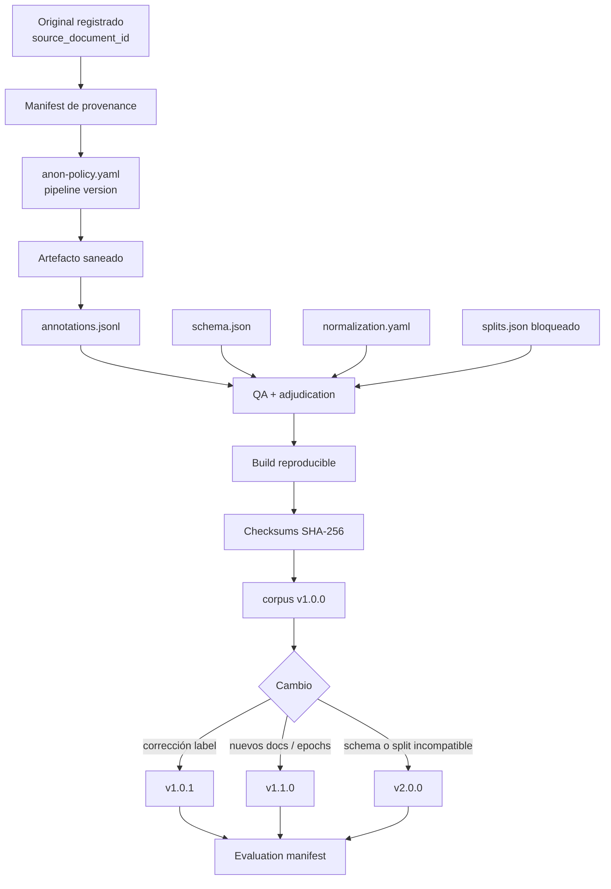

# Diseño de un corpus gold FR/ES/EN de extractos, liquidaciones y recibos de pago reales anonimizados

## Resumen ejecutivo

La recomendación principal es construir el benchmark como un **corpus de documentos estructuralmente reales pero con valores sensibles transformados**, y mantener claramente separados tres conjuntos: `gold_real`, formado por documentos reales aportados por comercios y saneados; `gold_official`, formado por muestras o plantillas oficiales publicables; y `augment_synthetic`, reservado a aumento de cobertura y stress testing. **El KPI principal de precisión/recall debe calcularse exclusivamente sobre `gold_real` bloqueado**, no sobre sintéticos. Esta separación evita que un extractor obtenga una puntuación artificialmente buena porque los generadores sintéticos reproduzcan las mismas regularidades que el propio extractor espera.

La primera oleada debería cubrir **Stripe, PayPal, SumUp y Adyen** en el eje internacional; **Santander/Getnet y CaixaBank** en España; y **Société Générale** en Francia. Son los proveedores que combinan mejor relevancia de pagos, variedad de documentos y posibilidad de reconciliación a nivel de transacción. Stripe documenta informes de balance y reconciliación de payouts, PayPal ofrece estados mensuales/personalizados y descargas de actividad en varios formatos, SumUp combina informes de payout y contabilidad, y Adyen dispone de Settlement Details y otras familias de informes de reconciliación. citeturn20search0turn20search20turn20search5turn20search9turn20search18turn20search6turn20search25

La segunda oleada debería ampliar la diversidad bancaria y TPV con **BBVA y Redsys en ES; BNP Paribas y Worldline en FR; HSBC UK y, opcionalmente, Lloyds/NatWest en EN**. BBVA documenta explícitamente los campos habituales de un extracto —titular, IBAN, fecha de operación, fecha valor, concepto, importe y saldo—; CaixaBank expone extractos de tesorería, movimientos de tarjetas y operaciones de comercios; Santander integra detalle de TPV Getnet, ventas, cierres y descarga de movimientos. En Reino Unido, HSBC permite PDF para estados y XLS/CSV desde la lista de transacciones, proporcionando un buen baseline bancario anglófono. citeturn21search2turn21search1turn21search0turn15search0

Desde el punto de vista jurídico, **sustituir nombres por hashes o alias no convierte automáticamente un conjunto en anónimo**. Bajo el RGPD, los datos seudonimizados siguen siendo datos personales cuando pueden volver a atribuirse a una persona utilizando información adicional. CNIL hace la misma distinción entre seudonimización reversible y anonimización efectiva. Las Guidelines 02/2026 del EDPB proponen analizar aislamiento de registros, vinculación e inferencia, pero, a fecha de **13 de agosto de 2026**, esas directrices están adoptadas para consulta pública y el periodo de comentarios sigue abierto hasta el **30 de octubre de 2026**; por tanto, deben usarse como orientación avanzada, no como texto final consolidado. citeturn16search0turn16search14turn16search33turn10view0turn16search5turn16search13

Además, el pipeline no debe permitir que datos de tarjeta innecesarios lleguen al entorno de anotación. PCI DSS v4.0.1 sigue siendo la versión publicada de referencia en 2026; PCI SSC establece requisitos para entornos que almacenan, procesan o transmiten datos de cuenta, y prohíbe conservar códigos de verificación de tarjeta tras la autorización, incluso cifrados. Para este corpus, la política prudente es **no conservar jamás CVV/CVC, PIN, track data ni PAN completo; reemplazar incluso los últimos dígitos reales de un PAN enmascarado por valores sintéticos**. citeturn18search1turn18search6turn18search8turn19search2turn19search1

Como objetivo de producción, propondría **1.500–2.500 documentos reales saneados**, procedentes idealmente de **30–60 cuentas/comercios donantes**, con al menos tres épocas de formato cuando haya histórico disponible, más un conjunto sintético independiente de 1.000–2.000 derivados para ruido y casos raros. El coste razonable es del orden de **129–186 persona-días**, distribuido en unas **14–18 semanas naturales** con 2,5–3 FTE de media más DPO/legal part-time. Es preferible un corpus de 1.500 documentos con alta diversidad de `provider × document_type × language × layout_epoch` que 20.000 documentos casi idénticos de un solo comercio.

La unidad básica que debe gobernar todo el proyecto no es el fichero, sino el **`source_document_id`**. Un mismo extracto puede existir como PDF nativo, PDF rasterizado, PNG, OCR-PDF y HTML impreso; todos esos derivados deben quedar en el **mismo split**. De lo contrario, se produce una fuga de test grave: el modelo podría ver en desarrollo el mismo contenido que posteriormente se puntúa en test con una conversión distinta.

## Proveedores y matriz de cobertura

### Priorización propuesta

`P0` significa que intentaría tener cobertura antes de declarar el corpus mínimamente representativo; `P1` es la ampliación inmediatamente posterior; `P2` cubre long tail, formatos nacionales y proveedores para pruebas de generalización.

| Prioridad | Proveedor / familia | Idiomas objetivo | Tipos de documento que conviene capturar | Formatos prioritarios | Motivo de inclusión |
|---|---|---|---|---|---|
| **P0** | **Stripe** | FR / ES / EN; comprobar el locale real de cada exportación | Balance/Balance Activity, Payout Reconciliation, payout detail, recibo, refund receipt, invoice/payment receipt | CSV, PDF, HTML/web view | Sus informes permiten reconciliar balance y payouts; Stripe documenta explícitamente el desglose de las transacciones que forman cada payout. Los recibos también pueden existir como vista web/PDF. citeturn20search0turn20search20turn20search4turn12search0turn12search8 |
| **P0** | **PayPal** | FR / ES / EN | Monthly Statement, Custom Statement, Activity Download, settlement/balance report, disputas, recibos | PDF, CSV, TAB; formatos contables adicionales según informe | Activity Download permite exportar detalle de transacciones y, actualmente, documenta hasta siete años con periodos máximos de 12 meses; Monthly/Custom Statements ofrecen PDF/CSV, aunque los custom se documentan para los tres últimos años. No debe asumirse una única retención para todos los productos PayPal. citeturn20search5turn20search9turn2search2turn2search3 |
| **P0** | **SumUp** | FR / ES / EN | payout report, accounting report, sales/transaction history, recibos TPV | PDF, CSV, XLS cuando esté disponible | El payout report relaciona transacciones liquidadas, fecha del payout y comisiones; el accounting report puede exportarse a CSV/PDF. Hay documentación localizada FR/ES/EN, especialmente útil para verificar variaciones lingüísticas reales. citeturn20search18turn20search6turn2search4turn2search13 |
| **P0** | **Adyen** | EN como núcleo; FR/ES en contenido y configuraciones reales | Settlement Details Report, Aggregate Settlement, External Settlement, Received Payment Details, receipt de terminal | CSV/otros exports configurables, XML/API receipt, ticket impreso | Settlement Details es explícitamente un instrumento de reconciliación a nivel de transacción; existen reportes complementarios y una muestra oficial de External Settlement. Los recibos de Terminal API proporcionan otra familia estructural muy diferente. citeturn20search25turn0search11turn0search26turn12search3turn12search7 |
| **P0** | **Santander / Getnet** | ES; opcional EN en clientes que lo usen | movimientos bancarios, detalle TPV, ventas, cierre de caja, descarga de movimientos, recibos/justificantes | PDF, Excel/CSV cuando proceda, ticket/imágenes | Santander permite visualizar facturación, detalle de transacciones, ventas y cierres Getnet, además de descargar movimientos desde el flujo de TPV. Es una fuente clave para vocabulario de adquirencia español. citeturn21search0turn3search2turn3search6 |
| **P0** | **CaixaBank** | ES | extracto/movimientos, extracto de tesorería, tarjetas, operación de comercio, extracto mensual de tarjeta | PDF y ficheros bancarios/normalizados | CaixaBank documenta descarga de extractos de tesorería, movimientos de tarjetas y operaciones de comercios; también Cuaderno 43 y otros ficheros normalizados. Un movimiento individual puede tener comunicado guardable como PDF. citeturn21search1turn21search3 |
| **P0** | **Société Générale / SG** | FR | relevé de compte, opérations, relevés cartes y, en segmento profesional, ficheros de conciliación/adquirencia | PDF, CSV, OFX, CFONB según producto | Los relevés están disponibles como e-documents PDF; la oferta profesional aporta diversidad de formatos estructurados particularmente valiosa para Francia. citeturn5search0turn5search1turn5search3 |
| **P1** | **BBVA España** | ES | extracto de cuenta, movimientos, justificantes | PDF/app/web; export estructurado cuando el partner disponga de él | Su documentación enumera fecha de emisión, titular, cuenta/IBAN, fecha operación, fecha valor, concepto, importe y saldo, convirtiéndolo en buen baseline para el esquema bancario español. citeturn21search2 |
| **P1** | **BNP Paribas** | FR | relevé de compte / relevés d'opérations, export de operaciones | PDF y export bancario disponible a cada segmento | Las páginas oficiales permiten acceso y descarga de operaciones/relevés; sirve para que el benchmark francés no dependa de un solo banco. citeturn4search0 |
| **P1** | **HSBC UK** | EN | current/business account statement y transaction export | PDF, XLS, CSV | HSBC documenta PDF para estados digitales y XLS/CSV desde la lista de transacciones; además indica acceso a estados históricos de hasta seis años en los canales citados. citeturn15search0turn15search4 |
| **P1** | **Worldline** | FR / EN; ES cuando haya partners | settlement/reconciliation, transaction reports, portal acquiring | PDF, CSV | MyPortal proporciona informes de settlement y visión de transacciones en PDF/CSV; la documentación española de Worldline también describe informes y conciliación mediante portal. citeturn4search2turn6search2 |
| **P1** | **Redsys** | ES | operaciones de comercio/TPV, informes programados, lotes/ficheros | ficheros e informes del portal del comercio | Es muy relevante para adquirencia española, pero la documentación pública útil para reconstruir un gold set es bastante menos rica que la de Stripe/Adyen; por ello conviene adquirir sus variantes principalmente mediante comercios y bancos partners. La documentación corporativa sí hace referencia a informes programados y procesamiento de operaciones por fichero. citeturn6search3 |
| **P2** | **Lloyds / NatWest** | EN | statement, transaction export, receipt management | PDF, CSV, QIF/OFX/XLS según entidad | Añaden heterogeneidad bancaria inglesa: Lloyds Business documenta CSV/QIF y NatWest PDF/OFX/CSV, además de PDF para statements. citeturn15search6turn15search20turn15search13 |
| **P2** | **Crédit Agricole** | FR | relevés de compte y historique d'opérations | PDF, CSV/OFX según canal | Útil como segundo/tercer banco francés una vez asegurada cobertura SG/BNP; la disponibilidad exacta debe verificarse por caisse/segmento y no extrapolarse de una única interfaz. citeturn4search1turn4search3 |

Una cobertura equilibrada no significa que todos los proveedores deban producir los tres idiomas. En **ES**, la prioridad local sería Santander/Getnet → CaixaBank → BBVA → Redsys, complementados por Stripe/PayPal/SumUp. En **FR**, SG → BNP Paribas → Worldline, además de los PSP globales. En **EN**, Stripe/PayPal/SumUp/Adyen deberían formar el núcleo de pagos y HSBC/Lloyds/NatWest el núcleo bancario. La separación entre `document_language`, `UI_locale`, `merchant_country`, `currency` y `provider_country` es imprescindible: un informe Adyen con encabezados ingleses puede contener un comercio francés, una moneda EUR y descriptores franceses.

### Cuotas de cobertura

En vez de fijar únicamente “N documentos por proveedor”, utilizaría una matriz:

**`provider × provider_product × document_type × language × format_epoch × original_format`**

y establecería un mínimo de cobertura por celda. Para las celdas principales, una meta práctica sería **20–40 documentos, procedentes de al menos 3–5 entidades donantes cuando sea posible**, antes de considerar la celda cubierta. Las familias extremadamente repetitivas pueden necesitar menos; las que contengan tablas, multi-moneda, chargebacks o fotografías de tickets necesitan más.

La unidad de diversidad más importante es `layout_family_id`, no el número bruto de ficheros. Mil monthly statements PayPal generados durante el mismo mes desde una única cuenta aportarán considerablemente menos evidencia de robustez que cien ejemplos distribuidos entre distintos años, idiomas, tamaños de tabla, tipos de operación y exportadores.

Para el histórico, propondría intentar cubrir **2021–2026** cuando sea accesible, pero sin inventar años. PayPal Activity Download documenta hasta siete años, mientras que su Custom Statement se limita en la documentación actual a tres años; HSBC documenta hasta seis años de statements en sus canales indicados. Esto ilustra por qué `availability_window` debe registrarse por producto y no por marca. citeturn20search5turn20search9turn15search0

## Legalidad, ética y adquisición

### Checklist de cumplimiento

El diseño debe partir de que los originales reales **pueden contener datos personales y datos financieros altamente vinculables**. La finalidad, minimización, limitación de conservación, protección desde el diseño y seguridad del tratamiento están recogidas en el RGPD; cuando el tratamiento sea probablemente de alto riesgo debe realizarse el correspondiente análisis de EIPD/DPIA conforme al artículo 35. citeturn16search0turn16search18

| Control | Decisión recomendada antes de ingerir datos reales | Criterio de aceptación |
|---|---|---|
| **Roles RGPD** | Documentar quién es responsable, corresponsable o encargado para cada flujo. No llamar automáticamente “DPA Art. 28” a cualquier acuerdo de intercambio. | Roles y responsabilidades aprobados por DPO/legal; Art. 28 cuando exista auténtica relación responsable-encargado y Art. 26 si procede corresponsabilidad. citeturn16search0 |
| **Finalidad** | Definir la finalidad estrecha: evaluar extracción de campos de documentos financieros, no construir perfiles de consumidores. | Finalidad escrita en registro del tratamiento y acuerdos. |
| **Base jurídica** | Determinar base del Art. 6 para el tratamiento real. La autorización contractual del comercio para entregar documentos **no demuestra por sí sola** que pueda tratarse cualquier dato de sus clientes/pagadores. | Dictamen/documentación interna por tipo de contribuyente y dato. citeturn16search0 |
| **Minimización** | Solicitar únicamente documentos y campos necesarios. Priorizar exportaciones ya parcialmente enmascaradas y ventanas temporales pequeñas. | No se reciben PAN/CVV/PIN u otros secretos de pago innecesarios. Los principios de minimización y privacidad desde diseño son centrales en RGPD y guías AEPD/CNIL. citeturn16search14turn16search7 |
| **DPIA/EIPD** | Hacer screening antes del piloto; completar EIPD si escala, vinculación o contexto producen riesgo alto. | EIPD cerrada antes de ampliar la recogida cuando proceda. citeturn16search18turn16search0 |
| **PCI** | Diseñar el canal de entrada para que CVV/CVC, PIN, track y PAN completo sean rechazados/eliminados antes del entorno de anotación. | Escáner DLP/pre-ingest sin coincidencias prohibidas; CVV no se conserva post-autorización. citeturn19search2turn19search1turn18search8 |
| **Anonimización vs seudonimización** | Considerar todo dataset con mappings, claves o posibilidad razonable de linkage como personal/seudonimizado. | Sólo etiquetar una release como “anonimizada” tras revisión de riesgo específica. AEPD y CNIL advierten expresamente que seudonimización y anonimización no son equivalentes. citeturn16search14turn16search33 |
| **Reidentificación** | Evaluar aislamiento, linkage y capacidad de inferencia; revisar también rarezas y outliers. | Informe de riesgo de release y ataque de linkage antes de difusión. Las Guidelines EDPB 02/2026 aportan este marco, aunque siguen en consulta pública. citeturn10view0turn16search5 |
| **Retención** | Original bruto durante el mínimo tiempo necesario para comprobar el saneamiento; después destruirlo salvo obligación legal justificada. | TTL automatizado y evidencias de eliminación. |
| **Transferencias internacionales** | Evitar que originales personales salgan innecesariamente del EEE; si existe transferencia, revisar capítulo V del RGPD y mecanismos aplicables. | Transfer map y mecanismo jurídico documentado. citeturn16search0 |
| **Copyright / términos** | Revisar licencia y términos de muestras oficiales, logotipos, interfaces y plantillas antes de redistribuirlos. | Corpus interno y corpus redistribuible claramente separados. |
| **Derechos de terceros** | Excluir documentos “encontrados en Internet”, foros, leaks o Google Images que parezcan contener datos financieros reales sin una procedencia y autorización claras. | Toda pieza tiene `provenance_class` y evidencia de licitud/permiso. |
| **Prohibición de reidentificación** | Incorporar cláusula contractual y control técnico que prohíba intentar reconstruir identidades. | Aceptación por usuarios del corpus y auditoría de accesos. |

La distinción es especialmente importante porque una tabla de pagos es de alta dimensionalidad: fecha, importe, comercio, banco, moneda, texto libre y referencias pueden combinarse para reidentificar incluso después de eliminar el nombre. NIST trata precisamente la de-identificación como una reducción del riesgo de divulgación que debe equilibrarse con utilidad, y la CNIL advierte que no debe presumirse que un conjunto bruto es anónimo. citeturn17search0turn16search3

### Vías de obtención de ejemplos

| Fuente | Papel recomendado | ¿Entra en el blind test principal? | Controles |
|---|---|---:|---|
| **Muestras oficiales públicas** | Arranque de esquemas, pruebas de parser y formatos raros | Sólo en un slice separado `gold_official` | Comprobar términos/licencia y que sea realmente una muestra, no un documento accidentalmente público |
| **Sandbox / test account del proveedor** | Crear invoices, receipts y settlement-like outputs controlados | No como sustituto de `gold_real` | Etiquetar `source_provenance=test_environment` |
| **Comercios partners** | Fuente principal de layout/noise/drift real | **Sí** | DSA, minimización, pre-redacción en origen, canal seguro, anonimización central |
| **Bancos/PSP bajo acuerdo de colaboración** | Muy alta calidad, acceso a variantes históricas difíciles | **Sí**, si los términos lo permiten | Acuerdo específico, roles RGPD, retención, restricciones de downstream use |
| **Plantillas reconstruidas desde documentación** | Completar familias que no pueden obtenerse | No | `synthetic/template=true`; no mezclarlas con real |
| **Aumento sintético seguro** | Outliers, multi-moneda, OCR, tipos raros, perturbaciones | No en KPI principal | Generación posterior a anonimización y test de memorisation/linkage |

Para **muestras oficiales**, Adyen es especialmente útil: publica una muestra descargable para External Settlement Detail Report y documentación de estructuras de receipt/virtual receipt; PayPal documenta informes de balance y otras familias con ejemplos/muestras; Stripe proporciona esquemas detallados de balance, reconciliación y recibos aunque la documentación no debe confundirse con un corpus de statements reales. citeturn0search11turn12search7turn0search22turn20search0turn12search0

Para **partners**, pediría paquetes pequeños pero ricos: por ejemplo, un comercio aporta un payout por trimestre durante varios años, un estado mensual con pocas operaciones, otro con varias páginas, un refund, un chargeback, una liquidación negativa/ajuste y, si usa TPV físico, dos o tres tickets impresos/fotografiados. Stripe contempla incluso situaciones de payout negativo por saldo insuficiente, y Adyen refleja eventos como reversals/chargebacks en sus informes, por lo que estos casos no deberían ser únicamente sintéticos. citeturn20search12turn20search28

El **Data Sharing Agreement** debería identificar, como mínimo, finalidad y usos prohibidos; categorías de documentos/datos; roles jurídicos; procedimiento de selección por el partner; pre-redacción obligatoria; canal de transferencia; conservación y destrucción; acceso; subencargados; localización; incidentes; solicitudes de derechos; prohibición de reidentificación; posibilidad de auditoría; reglas de publicación; propiedad/licencias; retirada futura; y qué ocurre con releases ya generadas. Cuando exista relación responsable-encargado, las obligaciones correspondientes deben reflejar el artículo 28 del RGPD. citeturn16search0

Los **datos sintéticos** deben complementar, no reemplazar, la evidencia real. La guía de AEPD sobre datos sintéticos advierte que no son inherentemente libres de riesgo: pueden filtrar información de los datos fuente si conservan demasiada semejanza, y recomienda, entre otras medidas, minimizar, eliminar/seudonimizar identificadores y generalizar o añadir ruido cuando el detalle no sea necesario. citeturn10view1 NIST también subraya que la eliminación ad hoc de identificadores no basta frente a ataques de linkage; técnicas formales como k-anonymity o differential privacy son relevantes en otros tipos de publicación, aunque para un corpus documental donde el layout exacto importa es más útil una transformación semántica controlada registro a registro que aplicar indiscriminadamente una técnica tabular. citeturn17search0turn17search1turn17search3

## Anonimización y conservación de edge cases

### Arquitectura de tres zonas

El error conceptual más peligroso sería llamar “anónimo” al fichero en cuanto el nombre del titular haya sido reemplazado. Propongo tres niveles:

**Zona Raw/Quarantine** contiene los originales y tiene acceso restringido al equipo de privacidad/ingestión. **Zona Pseudonymized Working** contiene transformaciones deterministas necesarias para QA y puede conservar mappings bajo secreto separado. **Zona Gold Release** no contiene el original ni mappings y sólo incluye documentos reconstruidos/saneados tras superar controles de riesgo.

Mientras exista una clave o tabla que permita reconectar fácilmente un alias con el original, debe tratarse como seudonimización, no como anonimización; esto es consistente con RGPD, AEPD y CNIL. citeturn16search14turn16search33

### Técnicas recomendadas por campo

| Dato sensible | Transformación | Estructura que se conserva | Regla de seguridad |
|---|---|---|---|
| Nombre/persona | Alias ficticio determinista dentro del documento o contributor | Longitud aproximada, mayúsculas, acentos si interesan al extractor | Nunca conservar iniciales reales como “atajo” |
| Razón social de comercio | Alias cuando identifica al donante; mantener sólo marcas de proveedor que sean parte del label | Número de líneas, longitud, sufijos `SL/SAS/Ltd` | Separar `provider_brand` de `merchant_identity` |
| Dirección | Dirección ficticia o generalizada | Orden calle/código/ciudad y line wrapping | No conservar combinación real código postal + calle |
| Email | Alias bajo dominios reservados como `example.com` | `local-part@domain`, signos y longitud aproximada | Nunca conservar dominio corporativo identificador salvo que sea el propio proveedor |
| Teléfono | Número sintético claramente no operativo | espacios, prefijos, longitud | No derivar el sustituto de los últimos dígitos reales |
| IBAN/cuenta | Alias **no enrutable**, por ejemplo checksum deliberadamente inválido en documentos derivados de reales | país, longitud, agrupación de caracteres | Un IBAN “válido” sólo en documentos 100 % sintéticos donde no proceda de un original |
| PAN | Eliminar PAN completo antes del corpus; un PAN ya enmascarado se reemplaza nuevamente por últimos dígitos aleatorios | `•••• 4821`, `**** **** **** 4821`, etc. | No preservar los últimos cuatro reales |
| CVV/CVC, PIN, track | Eliminación total | Nada | PCI prohíbe conservar CVV post-autorización incluso cifrado. citeturn19search2turn19search1 |
| Transaction / payout / authorization ID | HMAC con secreto de ingestión → alias de formato semejante | longitud, prefijo/tipo y consistencia interna | Un HMAC/link estable sigue tratándose como seudonimizado mientras exista posibilidad razonable de linkage |
| Fechas | Sustitución coherente preservando orden, intervalos y formato; opcionalmente conservar `year/format_epoch` | `dd/mm/yyyy`, `dd MMM`, timezone, cruces de mes/año | Evitar que fecha+importe+comercio mantengan una transacción pública identificable |
| Importes | Re-muestreo o transformación con restricciones | signo, moneda, decimales, relaciones contables | Recalcular todos los totales: gross − fees − refunds ± adjustments = net |
| Tipo de operación | Normalmente conservar | chargeback, refund, payout, card sale… | No suele identificar por sí solo |
| Descriptor libre | NER + reglas + revisión humana; sustituir nombres propios/números sensibles | puntuación, diacríticos, wrap, abreviaturas | Es la mayor fuente de “PII residual”; no fiarse únicamente de regex |
| QR / barcode | Sustituir completamente por un código sintético | dimensiones, quiet zone, densidad visual | Un código aparentemente opaco puede codificar URL/ID/importe real |
| Metadata PDF/imagen | Eliminar XMP/EXIF, comentarios, attachments, nombres de autor, hidden layers | sólo metadata técnica necesaria | Validar tanto bytes/objetos como imagen renderizada |
| Firma manuscrita/sello personal | Eliminar o sustituir | bounding box / presencia del objeto si importa | No usar blur como anonimización |
| Logo de comercio | Sustituir por placeholder de geometría equivalente | tamaño/posición | El logo del **provider** puede mantenerse si `provider` es un label explícito del benchmark |

La idea central es **preservar las invariantes que ponen a prueba al extractor y destruir las que permiten linkage**. Los importes originales no son necesarios para comprobar si el extractor entiende `1 234,56 €`; un importe alternativo `8 417,03 €` con el mismo separador, posición, tipografía y relaciones contables prueba exactamente esa habilidad con menor riesgo.

Las transformaciones deben ser **constraint-aware**. Si se cambia un pago de `100,00` a `317,42`, sus fee, refund, tax, net, payout balance y cualquier total de página deben modificarse coherentemente. De lo contrario, el corpus entrenaría/evaluaría sobre documentos contablemente imposibles y los casos sintéticos serían fácilmente detectables.

Para fechas, no aplicaría simplemente “+137 días” a toda la base si ello desplaza un documento de 2022 a 2023 y destruye el objetivo de medir format drift. Guardaría el año/`format_epoch` de origen como metadata y generaría fechas alternativas compatibles con esa época, conservando orden y distancias relevantes.

El caso de **PDF con redacción visual** merece tratamiento especial: el artefacto gold debería reconstruirse a partir de una representación ya saneada y no consistir simplemente en un rectángulo negro encima del original. El scanner de salida debe revisar texto extraíble, objetos embebidos, capas OCR, annotations y metadata además de la apariencia renderizada. La release sólo conserva el derivado saneado.

Finalmente, **el ruido debe aplicarse después de anonimizar**. Desenfocar un nombre real hasta hacerlo difícil de leer no es una técnica de anonimización satisfactoria; primero se sustituye el contenido y sólo después se generan blur, skew, JPEG artifacts, thermal fade, shadow o perspective distortion.

### Snippets de referencia

Los ejemplos siguientes son **completamente ficticios**. `ES00`, `FR00` y `GB00` se usan deliberadamente como identificadores no operativos; los últimos dígitos de tarjeta y los IDs son sintéticos.

**ES — cambio de layout y separadores**

```text
[FORMATO PDF · época 2022]

BANCO [ALIAS]
Cuenta: ES00 XXXX XXXX XXXX XXXX XXXX

Fecha op. | Fecha valor | Concepto                     | Importe      | Saldo
29/12/22  | 02/01/23    | LIQ. TPV / LOTE Q7M2        | +1.234,56 €  | 8.002,10 €
30/12/22  | 30/12/22    | DEVOLUCIÓN TPV (PARCIAL)    |    -12,30 €  | 7.989,80 €
```

```text
[FORMATO CSV · época 2026]

fecha_operacion;fecha_valor;descripcion;importe;moneda;saldo
"29/12/2026";"29/12/2026";"LIQUIDACIÓN TPV; LOTE R8K4";"1234,56";"EUR";"8002,10"
"30/12/2026";"02/01/2027";"AJUSTE — DEVOLUCIÓN";"-12,30";"EUR";"7989,80"
```

Aquí aparecen cuatro casos que el gold debe distinguir: `fecha_operacion ≠ fecha_valor`, un delimitador `;` dentro de un campo entrecomillado, coma decimal y cruce de año.

**FR — espacios tipográficos, acentos y tarjeta**

```text
RELEVÉ D’OPÉRATIONS
Compte : FR00 XXXX XXXX XXXX XXXX XXXX XXX

Date op.   Date valeur   Libellé                          Débit       Crédit
03/01/26   05/01/26      REMISE CB — LOT A4N7                       1 234,56 €
03/01/26   03/01/26      CARTE •••• 4821 — REMBOURSEMENT   17,90 €
04/01/26   04/01/26      COMMISSION / CARTE ÉTRANGÈRE       3,25 €
```

El espacio estrecho/no separable de `1 234,56`, `É`, el apóstrofo tipográfico y las abreviaturas `CB` son atributos que conviene preservar en la representación Unicode del gold.

**EN — CSV, descriptor con coma y negativo entre paréntesis**

```text
statement_date,reference,description,gross,fee,net,currency
2026-07-31,PAY_X7K2,"CARD SALE, TERMINAL 04","1,250.00","37.50","1,212.50",GBP
2026-07-31,REF_M9Q4,"PARTIAL REFUND •••• 4821","(45.25)","0.00","(45.25)",GBP
2026-08-01,FX_P3R8,"EUR→GBP DCC ADJUSTMENT","125.40","1.87","123.53",GBP
```

El gold debería conservar simultáneamente el **valor crudo** (`"(45.25)"`) y el **valor canónico** (`-45.25`), porque son dos preguntas distintas: “¿qué texto había?” y “¿qué cantidad representa?”.

## Metadatos y anotación gold

### Campos funcionales que debe poder extraer el sistema

No todos los campos son obligatorios en todos los documentos. El esquema debe utilizar `field_state = present | absent | not_applicable | illegible`, evitando confundir “el campo no existe en este tipo de documento” con un fallo del extractor.

| Grupo | Campos gold | Obligatorio cuándo | Normalización |
|---|---|---|---|
| **Identidad del documento** | `provider`, `provider_product`, `document_type`, `statement_id`, `receipt_type` | Provider/type siempre; IDs si aparecen | taxonomía controlada |
| **Periodo** | `issue_date`, `period_start`, `period_end` | estados/liquidaciones | ISO-8601 además del texto original |
| **Cuenta/comercio** | `merchant_id`, `store_id`, `terminal_id`, `account_id`, `iban_masked` | si aparecen | aliases de release, no datos reales |
| **Payout/settlement** | `payout_id`, `settlement_batch_id`, `payout_date`, `payout_amount` | informes de liquidación | decimal exacto + moneda |
| **Balances** | `opening_balance`, `closing_balance`, `available_balance` | statements/balance reports | `Decimal`, nunca float |
| **Totales** | `gross`, `fees`, `tax`, `refunds`, `chargebacks`, `adjustments`, `net`, `transaction_count` | según documento | decimal + currency; signo explícito |
| **Transacción** | `transaction_id`, `transaction_date`, `transaction_time`, `value_date`, `type`, `status` | tablas de detalle | vocabulario canonical + raw |
| **Importes por fila** | `gross_amount`, `fee_amount`, `tax_amount`, `net_amount`, `original_amount` | cuando aparezcan | decimal/currency |
| **Pago** | `payment_method`, `card_brand`, `masked_pan`, `auth_code`, `payment_reference` | receipts/transaction detail | únicamente valores saneados |
| **Divisa** | `currency`, `original_currency`, `exchange_rate`, `dcc_status` | multi-moneda | ISO 4217 si es inequívoca |
| **Receipt** | `receipt_datetime`, `subtotal`, `vat/tax`, `tip`, `surcharge`, `total`, `merchant_copy/customer_copy` | tickets | cantidades exactas |
| **Texto** | `descriptor`, `concept`, `memo`, `reason`, `chargeback_reason` | si visible | raw Unicode + opcional normalized |
| **Estado de extracción** | `present/absent/not_applicable/illegible` | todos los campos definidos | enum |
| **Evidencia** | página, bbox/polygon, offsets de texto, `table_row_id` | siempre que haya representación visual | coordenadas normalizadas |

Los campos bancarios de fecha de operación, fecha valor, concepto, importe y saldo no son una invención del esquema: BBVA los documenta expresamente como contenido de un extracto; CaixaBank igualmente presenta fecha/fecha valor, detalle, importe y saldo en movimientos. citeturn21search2turn21search3 Para PSP, los campos de fees, payouts, settlements, refunds y transaction-level reconciliation están reflejados en las familias de reporting de Stripe, SumUp y Adyen. citeturn20search0turn20search18turn20search25

### Metadata del ejemplar

| Campo metadata | Ejemplo | Por qué es necesario |
|---|---|---|
| `document_id` | `doc_01J...` | ID único de este artefacto |
| `source_document_id` | `src_H7M...` | Agrupa PDF/PNG/OCR/CSV derivados del mismo documento |
| `source_entity_id` | `donor_024` | Permite impedir fuga del mismo comercio entre splits |
| `provider` | `paypal` | Slice de evaluación |
| `provider_product` | `activity_download` | Evita agrupar productos estructuralmente distintos |
| `document_type` | `settlement_report` | Taxonomía funcional |
| `country` | `ES` | Contexto de producto |
| `language_primary` | `es` | Test cross-language |
| `languages_present` | `["es","en"]` | Documentos mixtos |
| `ui_locale` | `es-ES` | Separado del lenguaje detectado |
| `numeric_locale` | `es-ES` | Crucial para separadores |
| `currency_set` | `["EUR","GBP"]` | Multi-moneda |
| `timezone` | `Europe/Madrid` | Normalización temporal |
| `source_year` | `2024` | Drift |
| `format_epoch` | `paypal_activity_v3` | Mejor que inferir layout sólo por año |
| `layout_family_id` | `lf_041` | Análisis de generalización |
| `original_mime` | `application/pdf` | Evaluación por formato |
| `derived_mime` | `image/png` | Distingue conversión del original |
| `encoding` | `UTF-8` | CSV/TAB |
| `delimiter` | `;` | CSV |
| `has_text_layer` | `true` | OCR vs PDF nativo |
| `page_count` | `7` | Complejidad |
| `dpi_estimate` | `300` | imágenes/scans |
| `provenance_class` | `partner_real` | Real vs official vs synthetic |
| `consent_or_agreement_id` | `dsa_017` | Auditoría sin incluir contrato dentro del corpus |
| `anonymization_profile` | `anon-v3.2` | Reproducibilidad |
| `conversion_chain` | `pdf→png300→jpeg85` | Diagnóstico de ruido |
| `noise_labels` | `["skew","jpeg","shadow"]` | Slices |
| `noise_severity` | `2` | 0–3, definido internamente |
| `sha256` | hash | Integridad/versionado |
| `split` | `blind_test` | Inmutable para releases |
| `schema_version` | `2.1.0` | Compatibilidad |
| `annotation_status` | `adjudicated` | Calidad gold |

### Esquema de anotación

Una representación JSONL/parquet equivalente podría tener cuatro niveles. Es importante almacenar **raw y canonical por separado**: de otro modo, una corrección posterior de la normalización obliga a reanotar el documento.

| Nivel | Estructura | Campos principales |
|---|---|---|
| **Document** | una entidad por artefacto | metadata anterior, period, provider, summary totals |
| **Entity** | objetos encontrados | `label`, `raw_value`, `canonical_value`, `field_state`, `page`, `bbox`, `text_offsets` |
| **Table / transaction** | una entidad por fila lógica | `row_id`, transaction ID/date/type/status, amount/fee/net/currency, bbox de fila y de celdas |
| **Annotation provenance** | historial QA | `annotator`, `timestamp`, `guideline_version`, `review_state`, `adjudication_reason` |

Ejemplo conceptual:

```json
{
  "document_id": "doc_X8M2",
  "schema_version": "2.1.0",
  "fields": [
    {
      "label": "closing_balance",
      "raw_value": "1 234,56 €",
      "canonical_value": {
        "amount": "1234.56",
        "currency": "EUR"
      },
      "field_state": "present",
      "page": 2,
      "bbox": [0.713, 0.884, 0.932, 0.917],
      "review_state": "adjudicated"
    }
  ]
}
```

Para cada label conviene definir en las guidelines: definición positiva, contraejemplos, precedencia cuando hay varios candidatos, regla de normalización, tratamiento de duplicados, tratamiento de “subtotal vs total”, cuándo usar `not_applicable`, y varios ejemplos FR/ES/EN. El documento de guidelines debe versionarse exactamente igual que el esquema.

La QA no debería limitarse a “dos anotadores y kappa”. Para **importes, fechas, currency, payout IDs y totales**, la validación puede automatizar invariantes —sumas, recuentos, consistencia de moneda— además de revisión humana. Para campos financieros críticos, propondría adjudicar el 100 % de discrepancias; doble anotación completa de un 20–30 % estratificado del corpus y doble revisión de todas las nuevas `layout_family` antes de admitirlas en una release.

## Formatos, deriva y pipeline

### Recogida de variantes

Cada vez que el propio proveedor permita exportar el mismo periodo en varios formatos, conviene adquirirlos **en pareja**. PayPal, por ejemplo, documenta PDF/CSV para monthly/custom statements y PDF/CSV/TAB, entre otros, para Activity Download; SumUp documenta CSV/PDF para accounting reports; HSBC distingue el PDF del statement de los XLS/CSV extraídos desde la lista de transacciones. citeturn20search9turn20search5turn20search6turn15search0

No obstante, un CSV renderizado por el equipo a PDF **no debe etiquetarse como “PDF real del proveedor”**. Debe ser:

`format_original=csv`  
`format_derived=pdf`  
`conversion_chain=csv→html-render→pdf`

La distinción es fundamental para medir el rendimiento real por canal.

Una matriz deseable es:

| Original | Derivados de test | Uso |
|---|---|---|
| PDF nativo con text layer | PNG 150/300 dpi, PDF rasterizado, recomprimido | Separar extracción PDF nativa de visión/OCR |
| PDF escaneado | deskewed OCR-PDF, PNG/JPEG | Robustez OCR |
| CSV/TAB | UTF-8 normalizado, rendering visual | Parser estructurado vs representación visual |
| XLS/XLSX | CSV y PDF derivados | Variabilidad de conversiones |
| HTML/web receipt | HTML saneado, print-PDF, screenshot | DOM vs render |
| PNG/JPEG receipt | recompression, perspective, rotation, shadow | TPV/foto móvil |
| Receipt térmico | foto/scan + variantes de fade | ruido físico |

Para OCR, OCRmyPDF documenta operaciones de rotación, deskew y limpieza y advierte que determinadas opciones de limpieza pueden alterar visualmente el documento, de modo que los derivados deben revisarse; Tesseract soporta múltiples paquetes de idioma y permite combinar idiomas en OCR, lo que encaja con `spa+fra+eng`. citeturn13search0turn13search1turn13search10 Para conversiones ofimáticas reproducibles, LibreOffice documenta el modo headless y `--convert-to`, útil para producir derivados versionados desde XLS/XLSX u otros formatos. citeturn13search2turn13search8

### Drift

No asumiría que “año” equivale a “layout”. Mantendría dos dimensiones:

`source_year`: cuándo se emitió realmente el documento.  
`format_epoch`: familia de esquema/layout deducida de cabeceras, versión reportada por proveedor, fingerprint y revisión humana.

Un cambio de columnas PayPal en julio puede crear dos epochs en el mismo año; un template bancario puede permanecer idéntico cinco años. Adyen incluso permite configurar columnas en determinados informes, por lo que dos clientes del mismo año pueden pertenecer a variantes estructurales diferentes. citeturn0search11turn20search3

Para cada proveedor P0 intentaría reunir al menos:

- una época “antigua” accesible;
- una época intermedia;
- el formato vigente en 2026;
- una variante configurable o multi-page;
- una variante de formato distinto —por ejemplo CSV frente a PDF— cuando sea nativa.

Los documentos históricos aportados desde archivos del propio comercio son particularmente importantes cuando el portal sólo expone una ventana limitada. No deben descartarse porque ya no puedan descargarse hoy si el partner puede demostrar la procedencia.

### Pipeline

```mermaid
flowchart LR
    A[Partner / muestra oficial / sandbox] --> B[Zona RAW en cuarentena]
    B --> C[Hash + MIME + provenance]
    C --> D[Detección de PAN / PII / secretos]
    D --> E[Parse a representación intermedia]
    E --> F[Sustitución estructurada de valores]
    F --> G[Recalcular fechas, importes y totales]
    G --> H[Render nuevo documento saneado]
    H --> I[Escaneo de texto, metadata, QR y objetos]
    I --> J{Privacy QA}
    J -->|fallo| E
    J -->|aprobado| K[Gold candidate]

    K --> L[Anotación]
    L --> M[Revisión + invariantes contables]
    M --> N[Adjudicación]
    N --> O[Gold release]

    H --> P[Derivados: OCR / PNG / JPEG / conversiones]
    P --> O

    Q[Generador sintético] --> R[augment_synthetic separado]
```



El paso crítico es el **intermediate representation**. Para documentos de layout, puede representar página, bloques de texto, tablas, coordenadas, estilos y objetos; las sustituciones se realizan allí y después se renderiza un nuevo artefacto. De este modo se conserva la geometría sin conservar los objetos sensibles del PDF original.

Cada ejecución debe recibir una `pipeline_version` y parámetros inmutables. Una transformación no debería depender de una función aleatoria global sin seed: debe ser reproducible a partir de `source_document_id + anonymization_profile + secret_release`, pero la clave nunca debe viajar con el corpus.

Los logs operativos sólo deben contener IDs internos, categorías de detección y contadores; **nunca valores PII originales**. Los snippets de error que tantas pipelines imprimen por defecto son una vía habitual de volver a introducir datos sensibles en observabilidad.

## Evaluación y gobernanza del dataset

### Split que evite contaminación

Para un corpus destinado simultáneamente a desarrollar y validar el extractor, utilizaría:

| Partición | Proporción orientativa | Uso |
|---|---:|---|
| `development` | 50 % | reglas, prompts/model tuning, debugging |
| `validation` | 20 % | selección de thresholds/configuraciones |
| `blind_test` | 30 % | métrica que se reporta externamente |

La regla de split debe agrupar conjuntamente por **`source_document_id` y `source_entity_id`**. Idealmente también se controla `layout_family_id`. Ningún PNG, OCR-PDF o CSV derivado de un original en test puede aparecer en development, y un comercio que aporta seis años de statements debería mantenerse íntegramente en una única partición cuando se quiera medir generalización a nuevos donantes.

Los sintéticos **no cuentan** dentro de ese 50/20/30: forman `augment_synthetic`. Las muestras oficiales, por ser más fáciles de descubrir y potencialmente conocidas por modelos o librerías, deberían tener sus resultados separados de `blind_test_real`.

Dentro del test bloqueado mantendría cuatro slices:

**Core** estratificado por proveedor, documento, idioma y formato; **Drift** con epochs más nuevos no vistos durante tuning; **Cross-language**, manteniendo proveedor/tipo tan constante como sea posible al cambiar FR/ES/EN; y **Provider holdout**, con uno o varios proveedores/familias nunca utilizados en el desarrollo. Esto separa “sé parsear Stripe en tres idiomas” de “sé generalizar de Stripe a un banco francés”.

### Definición de precision/recall

Para cada ocurrencia gold de un campo:

\[
Precision = \frac{TP}{TP+FP}
\]

\[
Recall = \frac{TP}{TP+FN}
\]

\[
F1 = \frac{2PR}{P+R}
\]

Una predicción del campo correcto con **valor incorrecto** debe generar un `FP` y un `FN`, no un TP parcial. Los true negatives de campos ausentes no participan en precision/recall.

Reportaría al menos:

| Métrica | Qué detecta |
|---|---|
| **Field exact-match precision / recall / F1** | KPI principal |
| **Normalized exact-match** | reconoce equivalencias de representación |
| **Micro-F1** | rendimiento ponderado por frecuencia |
| **Macro-F1 por campo** | evita que `date`/`amount` oculten campos raros malos |
| **Macro por provider/language/type/epoch** | equidad de cobertura |
| **Transaction-row precision/recall/F1** | extracción de tablas completas |
| **All-required-fields document accuracy** | documentos totalmente correctos |
| **Financial consistency rate** | si totales extraídos cuadran |
| **Span/bbox metric** | sólo si el extractor devuelve localización |
| **CER/WER de OCR** | diagnóstico separado si la arquitectura incluye OCR |
| **Confidence calibration / PR curve** | si el sistema emite confidence scores |
| **95 % bootstrap CI** | incertidumbre del benchmark |

La normalización debe ser conservadora. `1 234,56 €`, `1 234,56 EUR` y `1234.56` pueden convertirse al mismo par canónico `("1234.56","EUR")`; pero **no aplicaría tolerancia numérica** a importes después de canonicalizar: `1234.55` no es equivalente a `1234.56`. Para textos descriptivos se puede publicar además token-F1 o edit distance como diagnóstico, pero no debería sustituir al exact match de campos críticos.

En tablas, una simple comparación por posición de fila falla cuando el extractor altera el orden. Conviene hacer un matching uno-a-uno entre filas gold y predichas utilizando IDs cuando existan o, en su defecto, una combinación de fecha/tipo/importe/referencia; después se puntúan los campos de cada par. Los duplicados requieren matching bipartito para no premiar una misma predicción dos veces.

Además de las métricas globales, cada release debería publicar una matriz de errores:

`provider × language × document_type × format_epoch × input_format × noise_type × field`.

Ésta es mucho más accionable que un único “F1 = 97,4 %”.

### Slices de estrés imprescindibles

El test debería contener, preferentemente con casos reales y complementado sintéticamente cuando no exista muestra suficiente:

`1.234,56` frente a `1,234.56`; espacio francés `1 234,56`; valores negativos con `-`, paréntesis o columnas debit/credit; fecha operación ≠ fecha valor; refund parcial; chargeback; payout negativo/ajuste; cero comisiones; multi-moneda/DCC; ID partido entre líneas; descriptor con coma o `;`; página nueva dentro de una transacción; header de tabla repetido; PDF con text order incorrecto; mixed FR/EN o ES/EN; diacríticos; recibo térmico tenue; rotación; JPEG fuerte; sombras; perspectiva de móvil; texto manuscrito/sello; y columnas nuevas o retiradas por drift. Stripe y Adyen documentan eventos financieros como payouts negativos, reversals/chargebacks, DCC y columnas configurables, por lo que varias de estas categorías pertenecen al dominio real y no son meras pruebas adversariales artificiales. citeturn20search12turn20search28turn20search3

### Almacenamiento y controles de acceso

Mantendría tres buckets/containers físicamente separados:

**`raw-quarantine`**: originales; sólo ingest/privacy; retención corta.  
**`pseudonymized-work`**: working set y mappings técnicos; acceso restringido.  
**`gold-release`**: sólo artefactos aprobados; lectura para ingeniería/evaluación.

Un almacén tipo S3 permite cifrado server-side, integración con KMS, versionado y Object Lock; Object Lock requiere versioning y puede impedir la eliminación/modificación de versiones durante un periodo de retención. AWS también documenta políticas IAM de least privilege. Estos mecanismos son ejemplos de implementación, no una obligación de usar AWS. citeturn14search0turn14search4turn14search6turn14search1

En producción utilizaría KMS/customer-managed keys para las zonas sensibles; SSO/MFA; RBAC o ABAC; acceso JIT para `raw`; logs de acceso; egress restringido; bloqueo de descargas masivas; secrets manager separado; scans DLP en entrada y salida; y alertas de acceso anómalo. La tabla de alias o la key de HMAC debe residir en un dominio de seguridad distinto del gold.

### Versionado reproducible



Una release debería contener, como mínimo:

```text
manifest.parquet
annotations.jsonl
schema.json
label_guidelines.md
normalization.yaml
noise_taxonomy.yaml
splits.json
anonymization_policy.yaml
pipeline_manifest.json
checksums.sha256
evaluation_config.yaml
CHANGELOG.md
```

El `splits.json` de una release publicada debe ser inmutable. Corregir un label no autoriza a “mover” el documento al development. Para mantener comparabilidad longitudinal, cada ejecución de benchmark registra exactamente `dataset_version`, `extractor_version`, `evaluation_code_version` y `normalization_version`.

También distinguiría **errores de anotación** de **cambios de esquema**. El primero puede producir un patch release; añadir documentos/format epochs sin cambiar semántica, un minor release; alterar definiciones de campos o splits, un major release. Es una convención de proyecto, pero facilita extraordinariamente auditorías y regresiones.

## Cronograma, recursos y fuentes prioritarias

### Plan de ejecución

Para un corpus de producción de aproximadamente 1.500–2.500 documentos reales, ésta sería una estimación razonable:

| Fase | Trabajo | Persona-días |
|---|---|---:|
| **Gobernanza y legal** | DPIA screening, roles, política de minimización, DSA/DPA templates, licencias | **12–18** |
| **Adquisición de partners** | selección, outreach, acuerdos, instrucciones de export, seguimiento | **20–30** |
| **Ingestión y registro** | uploader seguro, MIME/provenance, hashes, catálogo de formatos | **12–18** |
| **Anonimización** | detección PII/PCI, IR, substitutions, render, scans, privacy QA | **22–30** |
| **Taxonomía y annotation tooling** | schema, guidelines FR/ES/EN, UI de anotación, validadores | **10–14** |
| **Anotación y QA** | 1.500–2.500 docs, doble revisión estratificada, adjudicación | **35–50** |
| **Benchmark** | matching, normalización, metrics, slices, CI, reports | **10–14** |
| **Storage/versioning/release** | RBAC, manifests, CI, checksums, release process | **8–12** |
| **Total** |  | **129–186 persona-días** |

El calendario real será más largo que la suma lineal porque la principal ruta crítica no suele ser el desarrollo de código sino **conseguir acuerdos y variantes históricas**. Con una media de 2,5–3 FTE —por ejemplo, un data/ML engineer, un data engineer/privacy engineer y un annotator/QA lead, con DPO/legal y revisores FR/ES/EN a tiempo parcial— estimaría **14–18 semanas naturales**.

Un **MVP de 8–10 semanas y 55–75 persona-días** puede limitarse a Stripe, PayPal, SumUp, Adyen, Santander/Getnet, CaixaBank, SG y HSBC, con unos 500–800 documentos reales y un test bloqueado de aproximadamente 200–250. No lo usaría para declarar cobertura “europea completa”, pero sí para comprobar que el modelo de datos, anonimización y evaluación funciona antes de asumir costes de adquisición mayores.

La secuencia de calendario que más reduce riesgo es:

| Periodo aproximado | Entregable |
|---|---|
| Semanas iniciales | scope de campos, legal screening, threat model, schema v0.1, acuerdos tipo |
| Primer mes | primeras muestras oficiales + 3–5 partners, pipeline raw→sanitized v0.1 |
| Mes siguiente | 300–500 reales, guidelines estabilizadas, primeras layout families y doble anotación |
| Mes intermedio | ampliación histórica/formato, corpus 1.000+, benchmark y drift slices |
| Tramo final | 1.500–2.500 reales, privacy release review, blind split congelado, corpus v1.0 |
| Después de v1 | actualización trimestral/semestral de drift sin modificar el test histórico |

### Fuentes a consultar en orden de prioridad

| Prioridad | Fuente | Qué extraer de ella |
|---|---|---|
| **A** | **Stripe Documentation — Reporting / Payout Reconciliation / receipts** | familias de reportes, semántica balance-payout-transaction y tipos de recibo. citeturn20search0turn20search20turn12search0 |
| **A** | **PayPal Developer Reports** | Monthly/Custom Statements, Activity Download, formatos y ventanas de histórico. citeturn20search5turn20search9 |
| **A** | **SumUp Support FR/ES/EN** | payout, accounting, transaction/sales reports y exportaciones CSV/PDF. citeturn20search18turn20search6turn2search4turn2search13 |
| **A** | **Adyen Docs — Settlement/Receipts** | Settlement Detail y variantes, columnas, ejemplos oficiales, receipts Terminal API. citeturn20search25turn0search11turn12search3 |
| **A-ES** | **Santander / Getnet** | TPV, ventas, detalle, cierre y movimientos reales del merchant portal. citeturn21search0 |
| **A-ES** | **CaixaBank** | extractos, Cuaderno 43, tarjetas y operaciones de comercio. citeturn21search1turn21search3 |
| **A-ES** | **BBVA** | semántica bancaria española y campos de extracto. citeturn21search2 |
| **A-FR** | **Société Générale / SG** | e-relevés y variantes PDF/estructuradas profesionales. citeturn5search0turn5search1 |
| **A-FR** | **BNP Paribas** | relevés d'opérations y exportes. citeturn4search0 |
| **A-EN** | **HSBC UK** | statements PDF y exportes XLS/CSV, histórico. citeturn15search0 |
| **B** | **Worldline / Redsys** | ampliación de adquirencia/TPV europea; Redsys requerirá especialmente partners. citeturn4search2turn6search3 |
| **A-Legal** | **EUR-Lex — RGPD** | Arts. 5, 6, 25, 26/28, 32, 35 y capítulo V. citeturn16search0 |
| **A-Legal** | **AEPD** | ingeniería de privacidad, anonimización/seudonimización y datos sintéticos, en ES. citeturn16search6turn16search14turn10view1 |
| **A-Legal** | **CNIL** | anonimisation/pseudonymisation y riesgo de considerar anónimos datasets todavía vinculables, en FR/EN. citeturn16search23turn16search3turn16search33 |
| **A-Legal, provisional** | **EDPB Guidelines 02/2026 on Anonymisation** | framework de reidentificación y criterios de anonimización; marcar explícitamente que está en consulta hasta 30/10/2026. citeturn10view0turn16search5turn16search13 |
| **A-Security** | **PCI Security Standards Council** | PCI DSS v4.0.1, PAN/SAD y prohibición de almacenar CVV post-autorización. citeturn18search1turn18search6turn19search2 |
| **B-Research** | **NIST SP 800-188, De-Identifying Government Datasets** | threat/risk methodology, governance y utilidad frente a disclosure risk. citeturn17search0 |
| **B-Research** | **Sweeney, “k-anonymity: a model for protecting privacy”** | base formal para razonar sobre generalización/supresión y quasi-identifiers. citeturn17search1turn17search5 |
| **B-Research** | **El Emam et al., globally optimal k-anonymity** | implementación/evaluación de métodos de de-identificación estructurada y trade-off utilidad-riesgo. citeturn17search3 |
| **B-Tooling** | **OCRmyPDF / Tesseract / LibreOffice** | pipeline reproducible de OCR, deskew/multilingüe y conversiones headless. citeturn13search0turn13search10turn13search8 |

### Criterios de salida para `corpus-v1.0`

Yo no declararía la primera versión “gold” hasta que se cumplan simultáneamente estos criterios: todas las piezas tienen procedencia y base de tratamiento documentadas; no queda PAN completo, CVV/CVC/PIN/track ni PII directa sin tratar; el release privacy review está firmado; todos los derivados de una misma fuente comparten split; el blind test nunca se ha usado para tuning; cada proveedor P0 tiene más de una `layout_family`; FR, ES y EN tienen representación real suficiente y no sólo sintética; los campos críticos han pasado adjudicación; las reglas de normalización están congeladas; se pueden reconstruir bit a bit los manifests/annotations desde una pipeline identificada; y la evaluación produce resultados desglosados por proveedor, idioma, formato y epoch.

El diseño resultante produce un benchmark donde **“real” describe la procedencia del layout, la estructura, la paginación, el ruido y la deriva**, pero no obliga a conservar los nombres, cuentas, referencias, fechas exactas ni importes de personas reales. Esa distinción permite mantener el valor más importante para un extractor —la distribución real de formatos y errores— reduciendo de forma material el riesgo de privacidad y haciendo que la evaluación de precision/recall sea auditable y reproducible. El enfoque encaja con el principio de minimizar el riesgo de disclosure manteniendo utilidad descrito por NIST, con la distinción europea entre anonimización y seudonimización, y con las exigencias específicas de protección de datos de pago de PCI. citeturn17search0turn16search14turn16search33turn18search8