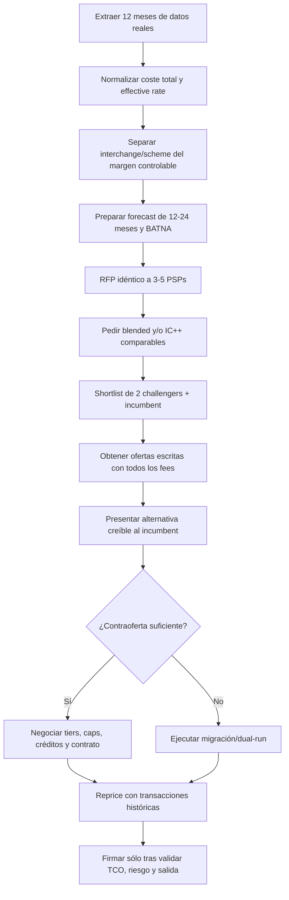

# Descuentos y pricing negociable de PSPs: priors, evidencia pública y playbooks de negociación

## Resumen ejecutivo

**Fecha de corte de la investigación: 13 de agosto de 2026.** Salvo indicación contraria, todas las URLs incluidas se comprobaron/accedieron el **13/08/2026**. El análisis separa deliberadamente tres clases de evidencia: condiciones oficiales publicadas por el PSP; testimonios de merchants identificables sólo por su cuenta pública y, por tanto, no verificables de forma independiente; e inferencias útiles para negociación. Un “estimado” no debe interpretarse como política comercial del PSP.

La principal conclusión es que **el pricing de pagos es mucho más negociable de lo que sugieren las tarifas self-service, pero la evidencia pública de verdaderas ofertas de retención —“digo que me voy y mi PSP me reduce la tarifa”— es sorprendentemente escasa**. Lo que sí aparece con frecuencia es: renegociación por volumen, cotizaciones especiales de adquisición, ofertas para desplazar a un competidor y concesiones condicionadas a permanecer. El caso más claro de retención encontrado es CardPointe/CardConnect: un merchant de menos de $3.000/mes relata que, al cancelar, el equipo de retención ofreció devolver una cuota anual únicamente si seguía procesando con ellos. En un caso mucho mayor, un restaurante con aproximadamente $2,5 millones/año relata que ya había renegociado Heartland una vez; Heartland le dijo después que no podía bajar más, lo que desencadenó una licitación entre alternativas. citeturn21view3turn22view2

En los PSP modernos, la señal más robusta es la documentación de los propios proveedores. **Stripe** publica expresamente IC+, tarifas planas descontadas, descuentos por volumen, descuentos multiproducto y precios ligados a compromisos; no publica un umbral de GPV. **Adyen** trabaja principalmente con una estructura de processing fee más coste del método de pago, con IC++ para tarjetas, y reconoce facturación mínima según industria/modelo. **Checkout.com** cotiza según perfil/riesgo y ofrece tanto flat-rate como IC++. **Global Payments** reconoce en su propio 10-K que los merchant discount rates varían por negociación. Esto implica que, para esos proveedores, buscar un único “precio de lista enterprise” es menos útil que negociar el **markup controlable**, los tiers y las condiciones contractuales. citeturn17view0turn17view1turn17view2turn17view3

Otros PSP sí publican gates cuantitativos que son excelentes **priors**. Square US invita a hablar de custom processing por encima de **$250.000/año**; una respuesta de su comunidad oficial añade que algunas evaluaciones históricamente exigían además ticket medio superior a $15. Braintree UK publica descuentos a partir de **£50.000/mes**; Mollie publica volume pricing por encima de **€100.000/mes**; Worldpay UK publica un custom tariff para determinados terminales por encima de **£75.000/año**, aunque otros canales de Worldpay manejan criterios distintos. Estos números deben tratarse como **puntos de entrada de cada producto/geografía, no como floors universales de la compañía**. citeturn16search0turn16search4turn16search1turn18search2turn16search2

Los testimonios públicos sugieren que la competencia real puede producir movimientos de precio económicamente relevantes. Un restaurante de ~$2,5 millones/año consiguió en una licitación histórica **3 bps + $0,05/transacción** de Merchant Warehouse durante dos años; más tarde la tarifa subió a 15 bps. Ese mismo merchant tenía Heartland a aproximadamente 14 bps + interchange + $0,04, una alternativa Payment Depot proyectada en ~2,258% effective rate y una oferta Square de 2,5% flat. Otro merchant afirma que Square le llegó a ofrecer **2,25%** cuando procesaba hasta ~$350.000 en su mejor mes. Un usuario de PayPal relata que PayPal lo llamó, redujo el precio y capturó todo el volumen que Stripe no había querido descontar. Son priors útiles, pero no equivalen a tarifas disponibles hoy. citeturn21view0turn21view1turn21view2

Hay además señales recientes de que **los incentivos de migración pueden ser una variable negociable independiente del MDR**. En 2026, un usuario de Reddit afirmó recibir de Mollie un **bonus de $50.000 para abandonar Stripe**. No publicó volumen ni contrato, y no existe corroboración pública, por lo que asigno confianza **baja-media**; no debe usarse como “Mollie paga $50k”, sino como evidencia de que conviene pedir explícitamente *migration credits*, servicios profesionales o buyouts de costes de switching. Por contraste, Mollie sí confirma oficialmente un programa de startups que puede eximir fees sobre hasta €1 millón, dependiendo del nivel de financiación, lo que demuestra oficialmente que los créditos comerciales existen dentro de su arsenal de adquisición. citeturn19search2turn18search2

Un caso de Braintree de 2026 ilustra otro aprendizaje: **una cotización verbal/comercial no es un precio hasta que está contratada**. Un merchant estadounidense que procesó $1,58 millones con PayPal en 2025, ticket medio ~$2.250 y sólo un chargeback en cinco años, afirma que Braintree le ofreció 2,1% + $0,30, aceptó, y posteriormente Braintree dijo que la oferta había sido un error y no podía conceder el descuento. El mismo merchant afirma que Stripe no quiso negociar precio hasta que hubiera procesado con Stripe durante seis meses. La parte Braintree está cuantificada; la supuesta política de seis meses de Stripe es sólo una declaración del usuario y **no aparece en la documentación pública de Stripe**, por lo que no debe generalizarse. citeturn23search0

En términos de negociación, el mejor playbook no es “pedir 30 bps”. Es obligar a todos los PSP a cotizar **el mismo mix transaccional**, separar costes de red/interchange del margen del PSP, obtener una cotización blended y otra IC++ cuando sea posible, introducir un competidor creíble, y negociar simultáneamente: markup, fee fijo, tiers, rebates, FX, cross-border, chargebacks, reserves, settlement, support, implementation, hardware/software y cláusulas de renovación. Global Payments recuerda que interchange constituye normalmente la mayor parte del coste y no es una palanca negociable del merchant/processor; por eso un vendedor que promete “rebajar interchange” merece escrutinio: las economías reales suelen venir del markup, del routing/adquirencia, de evitar downgrades/cross-border y de optimización de datos, no de que el PSP reescriba las tasas de los esquemas. citeturn16search12turn16search9

La regla económica para priorizar esfuerzo es sencilla:

\[
\text{Ahorro anual}=\text{GPV anual}\times\frac{\text{bps ahorrados}}{10.000}
\]

Así, **10 bps sobre €10 millones son €10.000/año; 25 bps son €25.000; 50 bps son €50.000**. En merchants grandes, negociar cinco partidas pequeñas —porcentaje, cents/txn, FX, disputes y fee de plataforma— puede valer bastante más que conseguir un titular llamativo de “20 bps menos”.

## Metodología, alcance y criterio de confianza

La investigación priorizó documentación comercial y contractual de los PSP, filings regulatorios cuando existían, páginas localizadas en España/Europa y, después, testimonios en Reddit y comunidades de merchants. Se descartaron como benchmarks principales las páginas de comparación SEO que publican supuestas “tarifas negociadas” sin contrato, merchant identificable o metodología.

Las tarifas de pagos presentan un problema estructural de comparabilidad. “2,2%” puede significar blended all-in; “IC++ + 20 bps” puede excluir interchange, scheme assessments, authorization fees o productos auxiliares; y dos merchants con el mismo GPV pueden tener costes muy distintos por ticket medio, débito/crédito, consumer/commercial cards, domestic/cross-border, card-present/card-not-present, MCC, fraude, chargebacks, monedas, países de acquiring y forma de liquidación. Adyen, por ejemplo, explica su IC++ como una estructura que conserva el detalle de interchange y scheme fees por transacción, mientras que Checkout.com ofrece tanto una tarifa plana como IC++. citeturn17view1turn17view2

Por ello utilizo cuatro niveles de confianza:

| Confianza | Interpretación en este informe |
|---|---|
| **Alta** | Página oficial actual, contrato/legal terms o filing del PSP. Adecuada para afirmar que un programa/modelo existe. |
| **Media-alta** | Merchant en primera persona con GPV, proveedor y cifras concretas que encajan internamente, pero identidad/contrato no verificables. Buena como prior, no como “rate card”. |
| **Media / baja-media** | Testimonio en primera persona pero faltan volumen, contrato, geografía o importe exacto; o la oferta fue retirada. |
| **Baja** | Claim promocional, comentario de tercero o incentivo extraordinario sin corroboración. Sólo sirve para formular una pregunta en negociación. |

Una distinción particularmente importante es la siguiente: **retention** significa que el proveedor actual concede algo para impedir la salida; **win-back/acquisition** significa que otro PSP subsidia el cambio; **custom pricing** significa que el merchant consigue una tarifa individualizada sin que exista necesariamente una amenaza de abandono. Mezclarlos inflaría artificialmente la evidencia sobre tácticas de amenaza. Los casos siguientes mantienen esa separación.

### Qué no debe inferirse de los datos

Un threshold publicado en un país no es automáticamente aplicable en España. La página estadounidense de Square usa $250.000/año, mientras que páginas de otras geografías publican cifras/monedas diferentes; Braintree publica £50.000/mes para UK y €60.000/mes para determinadas jurisdicciones de las Islas del Canal/Isla de Man. PayPal conserva páginas localizadas donde una “preferred rate” puede solicitarse a partir de $3.000/mes y 90 días de antigüedad, pero eso **no demuestra que PayPal España tenga ese mismo gate en 2026**. citeturn16search0turn16search1turn18search1

Del mismo modo, cuando indico “umbral estimado = no determinable” no es una omisión: significa que **inventar un número produciría un prior peor que no tenerlo**. Para Stripe, Adyen, Checkout.com, Global Payments y Nuvei no he encontrado un threshold universal y actual públicamente defendible.

## Evidencia pública: retención, renegociación y ofertas de switching

### Casos donde existe una señal directa de retención o renegociación

| Caso | PSP | Volumen del merchant | Oferta/concesión relatada | Clasificación | Inferido | Confianza | Fuente |
|---|---|---:|---|---|---|---|---|
| Merchant de pequeño negocio llama para cancelar por fees no acordadas | **CardPointe / CardConnect** | **≤$3k/mes** declarado | Retention rep ofreció **revertir/refund la annual fee sólo si el merchant continuaba procesando**; si cerraba, no se la devolvían | **Retención directa** | No para la condición; sí desconocemos importe de la cuota | **Media-alta**: primera persona, detalles de volumen y conversación, sin contrato verificable | https://www.reddit.com/r/smallbusiness/comments/1htoiga/virtual_terminal_for_payment_processing/ — acceso 13/08/2026. citeturn21view3 |
| Restaurante intenta rebajar costes de Heartland | **Heartland** | ~$2m/año Visa/MC/Discover + ~$0,5m Amex; ticket ~$60 | Merchant dice que **ya había renegociado una vez** con Heartland; el proveedor le dijo después que no podía bajar más, por lo que comenzó a buscar sustituto. Rate en ese momento: ~14 bps + interchange + $0,04 sobre las redes no-Amex | **Renegociación previa + churn real**, pero no conocemos la concesión de la primera renegociación | Sí: no se puede cuantificar el descuento obtenido | **Media-alta** | https://www.reddit.com/r/smallbusiness/comments/5zoezc/changing_credit_card_processor_for_a_restaurant/ — acceso 13/08/2026. citeturn22view2 |
| Negociación histórica mediante licitación agresiva | **Merchant Warehouse** | Mismo restaurante, ~$2,5m/año total | Merchant afirma haber logrado durante dos años **3 bps + $0,05/txn**, tras hacer competir a más de 20 procesadores; posteriormente el markup pasó a 15 bps | No es retención estricta; **competitive bid** | No en la cifra; sí en la causalidad exacta | **Media-alta** | Mismo hilo anterior. citeturn21view0turn22view1 |
| Negociación previa de un usuario de Stripe | **Stripe** | No publicado | Usuario afirma: “negotiation with Stripe” y que Stripe **bajó algo la tarifa por mayor volumen** | Custom/renegociación, no amenaza de churn demostrada | Importe y GPV desconocidos | **Media** | https://www.reddit.com/r/smallbusiness/comments/11jzpuz/reducing_credit_card_processing_fees/ — acceso 13/08/2026. citeturn20search2 |

El resultado relevante es que **sólo CardPointe cumple limpiamente el patrón “quiero cancelar → concesión explícita si me quedo” con la información pública localizada**. Heartland demuestra que la renegociación de incumbentes ocurre, pero no publica el delta de precio. Presentar todos los demás casos como “retention offers” sería exagerar la evidencia.

### Ofertas de adquisición y custom pricing que sirven como priors

| Caso | PSP que oferta | Volumen aproximado | Oferta pública relatada | Qué enseña | Confianza |
|---|---|---:|---|---|---|
| Restaurante de ~$2,5m/año | **Square** | ~$2,5m/año, ticket $60 | **2,5% flat incluyendo Amex** | El competidor puede simplificar/blendear el mix aunque no gane en effective rate | Media-alta. citeturn21view0 |
| Merchant Square mencionado por comentarista | **Square** | “$350k en nuestro mejor mes” | **2,25%** ofrecido “unos años antes” | A varios millones de GPV anualizado, descuentos sustanciales frente al sticker pueden existir | Media, porque es un comentarista y faltan condiciones. citeturn21view1 |
| Merchant PayPal/Stripe | **PayPal** | “significant volume”, sin cifra | PayPal llamó, hizo **rate reduction** y “got all the business” frente a Stripe | El PSP challenger puede financiar el desplazamiento del incumbent | Media. citeturn21view2 |
| Mismo hilo PayPal | **PayPal** | Comentario sugiere ~$4k/mes | Se recomienda decir a PayPal que Stripe recibe la mayor parte del volumen para pedir mejor tarifa; autor afirma que ~$4k/mes era un punto de reducción observado | Táctica de share-of-wallet; **no es política oficial** | Baja-media. citeturn21view2 |
| Merchant Shopify obligado a salir de PayPal Pro | **Braintree** | **$1,58m en 2025**, AOV ~$2.250, 1 chargeback/5 años | Braintree ofreció **2,1% + $0,30**, frente a 2,2% + $0,20 actual; después **retiró la oferta por “error”** | Pedir term sheet firmado y validez de oferta antes de parar el RFP | Media-alta para el relato; oferta **no ejecutada**. citeturn23search0 |
| Poaching de Stripe en 2026 | **Mollie** | No publicado | Usuario afirma recibir **$50.000 de “moving fee” para dejar Stripe** | Conviene negociar migration/onboarding credits aparte del MDR | **Baja-media**, por importe extraordinario y ausencia de corroboración. citeturn19search2 |
| Merchant Square, sin oferta concluida | **Square** | >$1m trailing 12 meses | Merchant dice estar pagando ~3% y abre negociación; el hilo confirma demanda de custom pricing pero no un resultado | No usar como benchmark de descuento | Media para volumen/coste, nula para resultado. https://www.reddit.com/r/smallbusiness/comments/x3s26c/anyone_ever_negotiated_better_fees_with_square/ citeturn20search4 |

El caso Braintree permite cuantificar por qué hay que mirar **effective rate y ticket medio**, no sólo el porcentaje. Con AOV de ~$2.250, 2,1% + $0,30 equivale aproximadamente a **2,113%**, mientras que 2,2% + $0,20 equivale a ~**2,209%**: unos **9,6 bps** de diferencia sobre ese ticket representativo, antes de otros fees. Sobre $1,58 millones serían del orden de $1.500/año, lo que también explica por qué el merchant puede valorar soporte, integración y condiciones tanto como el headline rate. Los inputs proceden del relato y la oferta fue retirada, por lo que el cálculo es ilustrativo, no un precio Braintree disponible. citeturn23search0

### Línea temporal de señales públicas útiles

```text
~2017          ~2019            ~2023             ~2024-25              2026
  │               │                │                   │                   │
  ▼               ▼                ▼                   ▼                   ▼
Restaurante     Square 2,25%    Stripe: "bajó      CardPointe:           Braintree:
~$2,5m/año      reportado a     algo" por mayor    refund de fee         2,1% + $0,30
licita PSPs;    merchant con    volumen            sólo si permanece     ofrecido y retirado
3 bps + 5¢      mes pico                             con el PSP
Merchant        ~$350k                                                     Mollie:
Warehouse                                                                    $50k para
                                                                             "dejar Stripe"
```

La cronología no demuestra una tendencia estadística; simplemente muestra que **descuentos por volumen, competitive bids y créditos de switching aparecen en distintos ciclos de mercado**, mientras que los detalles casi siempre permanecen confidenciales. citeturn21view0turn21view1turn20search2turn21view3turn23search0turn19search2

## Mapa de pricing negociable por PSP

### Tabla comparativa principal

| PSP | Modelo público / disponible | Umbral negociable conocido | Umbral estimado o prior útil | Ejemplos de descuentos/ofertas reportados | Condiciones y palancas visibles | Confianza |
|---|---|---|---|---|---|---|
| **Stripe** | Standard blended/self-service; custom con **IC+**, flat rates descontadas, suscripción/purchase rates para plataformas | **No publica GPV mínimo universal**; dice “grandes volúmenes” o modelos únicos | **No hay número defendible**. Prior: abrir sales motion cuando el GPV/commitment sea material o el modelo sea estratégico; no asumir un threshold concreto | Merchant dice que Stripe “lowered it … a bit due to higher volume”; importe no publicado | Tiers por volumen, commitments, multiproduct, país, Payments + Radar/Connect/Billing, soporte | **Alta** programa; **media/baja** benchmarks anecdóticos. https://stripe.com/es/pricing citeturn17view0turn20search2 |
| **Adyen** | Processing fee + payment-method fee; tarjetas típicamente **IC++** | **Sin threshold numérico universal publicado** | No estimable con rigor. El volumen mensual sí forma parte de la economía del acquiring; además existe facturación mínima según sector/modelo | No encontré un merchant case cuantificado de retención suficientemente fiable | Processing fee, acquiring markup, minimum invoice, local acquiring, métodos locales | **Alta** en modelo; **baja** en threshold. https://www.adyen.com/es_ES/precios citeturn17view1 |
| **PayPal** | Blended según producto; en determinados productos/mercados **IC+ / IC++** y custom high-volume | US: custom para merchants establecidos con “large volume annually”, **sin cifra**. Algunas páginas localizadas permiten preferred rates >**$3k/mes** + cuenta >90 días; **no portable a España** | Para España: **N/D**. Usar los $3k sólo como evidencia de que PayPal opera gates por mercado | Usuario: PayPal llamó y capturó todo el negocio con una reducción, sin rate publicado | Share-of-wallet, Wallet + cards, IC++, dispute/seller tools, FX | Alta para disponibilidad; media para caso. https://www.paypal.com/us/business/fees ; https://www.paypal.com/lc/webapps/mpp/business-support/pricing citeturn18search4turn18search1turn21view2 |
| **Worldpay** | Blended/simple y custom/variable según producto | UK terminal: custom por encima de **£75k/año de card turnover**; ecommerce: custom para “large transaction volumes”; otros funnels publican gates distintos | **No generalizar £75k** a enterprise/ecommerce ni a España | No localicé descuento de retención actual cuantificado con suficiente calidad | Variable Visa/MC, terminal rental, joining fee, settlement, plazo contractual | Alta para producto UK. https://www.worldpay.com/en-GB/products/countertop-card-machines citeturn16search2 |
| **Global Payments** | Flat-rate e **interchange-plus**; merchant discount negociado | Sin threshold contractual público | Página propia considera IC+ potencialmente económico a partir de **$5k–$7k/mes**, pero **esto no es un threshold de negociación** | No merchant retention rate fiable localizado | Merchant discount, per-item, B2B Level 2/3, large-ticket optimization | **Alta** en negociabilidad porque consta en 10-K. https://investors.globalpayments.com/financial-information/all-sec-filings/content/0001123360-26-000008/gpn-20251231.htm citeturn17view3turn16search6 |
| **Checkout.com** | **Flat-rate custom e IC++**; cotización según perfil y riesgo | Sin threshold público; pricing es sales-led | No tiene sentido inventar GPV gate: el propio modelo es personalizado | No encontré caso público cuantificado suficientemente fiable | Processor margin, risk category, acquiring geográfico, FX, productos adicionales | **Alta** para modelo; baja para threshold. https://www.checkout.com/es-es/pricing citeturn17view2 |
| **Braintree / PayPal Enterprise Payments** | Custom flat rate, **interchange-plus**, discounted rates | UK: >**£50k/mes**; GG/IM/JE: >**€60k/mes** en la página consultada | Fuera de esas geografías: N/D | Merchant $1,58m/año recibió 2,1%+$0,30 pero la oferta fue retirada | Modelo de negocio, processing volume y otras métricas de pagos | Alta threshold UK; media para caso. https://www.braintreepayments.com/en-gb/braintree-pricing citeturn16search1turn16search5turn23search0 |
| **Square** | Blended/flat por plan + custom processing | US: >**$250k/año** para optar a conversación de custom pricing; comunidad oficial histórica: algunos casos además AOV >$15 | No hace falta estimar en US: existe gate público. Confirmar localmente en cada país | 2,25% reportado por merchant con mes pico ~$350k; restaurante ~$2,5m/año recibió 2,5% flat | **Hardware discounts, onboarding/implementation support, technical specialists y account management** expresamente negociables/consultables | Alta oficial, media anecdótica. https://squareup.com/us/en/pricing citeturn16search0turn16search4turn21view1turn21view0 |
| **Mollie** | Standard por método + volume/custom; oferta enterprise con IC++ en determinadas propuestas | **>€100k/mes** para volume discounts en pricing actual | Umbral oficial suficientemente claro; verificar entidad/país y mix | Claim no corroborado de **$50k migration bonus** para abandonar Stripe | Volume discount; startup programme con fees waived sobre hasta €1m según funding; cuenta/servicio enterprise | Alta programa, baja-media bonus. https://www.mollie.com/pricing citeturn18search2turn19search2 |
| **Nuvei** | Enterprise/high-volume; promueve **IC++** frente a flat pricing | No publica un threshold universal | N/D; tratar como RFQ enterprise | Sin caso cuantificado fiable localizado | Processor markup, acquiring local, FX, routing, risk/reserve, vertical-specific economics | Media-alta modelo; baja threshold. https://www.nuvei.com/posts/whats-the-best-payment-processor-for-enterprises citeturn18search3 |

### Lectura correcta de los thresholds

Hay tres tipos de threshold y conviene no mezclarlos.

**Threshold de elegibilidad comercial.** Square $250k/año, Mollie €100k/mes y Braintree UK £50k/mes son ejemplos claros de “a partir de aquí existe un motion específico”. citeturn16search0turn18search2turn16search1

**Threshold económico.** El artículo de Global Payments que sitúa IC+ como potencialmente más económico una vez que se procesan ~$5k–$7k/mes es una recomendación de elección de modelo, no una promesa de que ventas vaya a aprobar un descuento a ese nivel. Debe usarse para decidir cuándo analizar IC+, no como frase “Global Payments negocia desde $5k”. citeturn16search6

**Threshold de poder de negociación.** No depende sólo de GPV. El PSP valora, entre otros, ticket medio, mix de tarjetas, geografía, fraude/chargebacks, crecimiento, vertical, margen adicional de productos, esfuerzo de soporte y probabilidad real de ganar o perder el account. Square lo hace explícito en su comunidad —tipo de negocio, payment volume, average transaction size e historial— y Checkout.com declara que fija precios según perfil de negocio y categoría de riesgo. citeturn16search4turn17view2

### Qué parte del precio debe negociarse

Para una tarjeta con IC++ el coste económico puede pensarse así:

\[
C = I + S + A + P + F + X + R
\]

donde **I** es interchange, **S** scheme/network fees, **A** acquiring/processor percentage markup, **P** fee fijo por autorización/transacción, **F** otros fees recurrentes, **X** FX/cross-border y **R** costes de riesgo/disputes/reserves.

Global Payments señala que interchange es fijado por las redes/emisores y normalmente representa la mayor parte del processing cost; su 10-K confirma, en cambio, que el **merchant discount** sí varía según negociación. En IC++ la conversación debe centrarse principalmente en **A, P, F, X y parte de R**, junto con optimización operacional que evite costes innecesarios. citeturn16search12turn17view3

Éste es también el motivo por el que comparar “2,4% Stripe” contra “IC++ + 20 bps” sin un statement reprice transacción por transacción es metodológicamente débil.

## Playbooks de negociación por proveedor

### Flujo recomendado



La idea central es **no empezar por “dame un descuento”**. Primero se crea una alternativa creíble. La experiencia del restaurante que llamó a más de veinte processors hasta lograr 3 bps + $0,05 muestra el poder de la competencia, aunque hacerlo manualmente fue costoso; el merchant de PayPal/Stripe muestra el patrón inverso, donde el challenger llama y captura el account con una reducción. citeturn21view0turn21view2

### Stripe

La primera petición debería ser una **cotización custom completa**, no simplemente “X bps menos que el sticker”. Stripe publica que sus paquetes personalizados pueden incluir **IC+, discounted flat rates, descuentos por volumen, discounts multiproducto, pricing por país, compromisos y uso de producto**. Estas son, por tanto, las palancas con evidencia oficial más fuerte. citeturn17view0

Para un merchant grande, el orden recomendado es: proporcionar el mix real; pedir simultáneamente un caso IC+ y un caso discounted blended; pedir tiers de GPV futuros; añadir Payments + Radar/Billing/Connect sólo después de solicitar el precio incremental de cada producto; y poner sobre la mesa una previsión de crecimiento comprometible. A cambio de un minimum commitment, pedir **rate lock, tiers automáticos descendentes y protección frente a repricing unilateral**. Esto último es una petición contractual recomendada, no un producto público garantizado por Stripe.

El BATNA funciona mejor cuando es concreto: “Checkout/Adyen nos ha repriced las últimas N transacciones y el ahorro es €X, el coste de migración es €Y, necesitamos que el gap neto quede por debajo de Z”. No conviene bluffear una oferta inexistente. El testimonio público sólo permite decir que Stripe ha reducido precio “algo” por mayor volumen en algún caso; no proporciona base sólida para prometer 10, 20 o 50 bps. citeturn20search2

Un dato interesante del merchant de $1,58m/año es que afirma que un vendedor de Stripe le pidió seis meses de tenure antes de negociar. **No lo trataría como política Stripe:** no aparece en la página oficial y podría haber sido una decisión de ese account/risk/sales team. Sí sirve como pregunta de RFP: “¿Existe requisito de tenure o de volumen procesado con vosotros antes de aplicar custom pricing? Incluidlo por escrito”. citeturn23search0

### Adyen

Con Adyen el objetivo no debe ser “descontadme interchange”. Su arquitectura pública es naturalmente más transparente: processing fee más coste del método y, para tarjetas, IC++. También declara que no cobra setup/integration/closure fees en la estructura general mostrada, pero sí puede aplicar **minimum invoice según industria o modelo de negocio**. citeturn17view1

Por ello pediría, por este orden: reducción del **acquiring markup** por escalones; reducción del processing fee fijo por txn; disminución o eliminación de minimum billing durante ramp-up; pricing diferente por región/MID; revisión de costes de acquiring local frente a cross-border; y una tabla contractual que identifique exactamente qué fees son pass-through.

Para un merchant multicountry, el argumento más potente es repartir el forecast por país y ofrecer un **share-of-wallet progresivo**: por ejemplo, país A al go-live, B/C tras métricas de autorización acordadas. Ello crea una moneda de cambio distinta del volumen ya existente.

### PayPal

PayPal debe negociarse en dos planos: wallet/PayPal branded checkout y card processing. La página estadounidense confirma custom rates e interchange-plus para merchants establecidos de alto volumen, mientras que UK documenta IC+/IC++ en productos de card processing. La página española pública, por su parte, mantiene su propio catálogo de merchant fees, por lo que no debe trasladarse directamente una tarifa estadounidense a España. citeturn18search4turn18search0turn15search1

La táctica de mayor valor es **share-of-wallet**. Presentar qué porcentaje del checkout va hoy a PayPal frente a Stripe/Adyen/etc., cuánto podría consolidarse y qué reducción hace falta para justificarlo. Ese es exactamente el mecanismo descrito en el hilo donde se aconseja informar a PayPal de que Stripe se lleva la mayoría de las ventas; otro merchant del mismo hilo afirma que PayPal lo llamó y ganó todo su volumen con una reducción. citeturn21view2

Además del MDR, conviene pedir explícitamente: IC+/IC++ como alternativa al blended; fee de cross-border y FX; fees de disputes; condiciones de Seller Protection para el caso de uso concreto; account-management escalation; y pricing incremental de otros productos. Un “descuento PayPal” que se recupera vía FX o international fee no es un descuento económico real.

### Braintree

Braintree tiene una ventaja para la negociación: reconoce públicamente **custom flat rates, interchange plus y discounted rates** en función del modelo de negocio y volumen, y la página UK da un gate concreto de £50k/mes. citeturn16search1turn16search5

En este caso, el playbook debería incluir una condición muy específica derivada del caso de 2026: **“commercial offer subject to underwriting” debe convertirse cuanto antes en un documento vinculante o term sheet claro**. No detendría conversaciones con otros PSP hasta tener: precio, duración, geografía, productos incluidos, underwriting approval, effective date y authorized sign-off. El merchant de $1,58m/año sufrió precisamente lo contrario: aceptó 2,1% + $0,30 y recibió después un correo diciendo que la tarifa había sido ofrecida por error. citeturn23search0

Su perfil —AOV ~$2.250, muy pocos chargebacks— también enseña qué datos mostrar. Un account de ticket alto y baja incidencia puede vender su **cost-to-serve/risk profile**, no sólo el GPV. Eso no garantiza una tarifa concreta, pero mejora la historia económica presentada a underwriting y sales.

### Square

Square ofrece uno de los playbooks más claros porque la propia página pública dice qué preguntar. Por encima de $250k/año en US invita a discutir custom processing y menciona expresamente **hardware discounts, onboarding and implementation support, technical specialists y account management**. citeturn16search0

Por tanto, el merchant no debería gastar toda su concesión comercial en 10–15 bps. Debe cotizar un paquete: processing rate + software + hardware + implementation + dedicated support. Para un retailer/restaurante que sustituye terminales en muchas locations, un descuento de hardware o rollout puede tener más NPV que unos pocos bps.

El antecedente de 2,25% reportado a un merchant con ~$350k en su mejor mes es un **anchor anecdótico histórico**, no una rate card actual. Presentarlo a Square como “sé que ofrecéis 2,25%” sería débil; presentarlo internamente como evidencia de que *flat-rate custom* puede separarse materialmente del sticker es razonable. citeturn21view1

### Worldpay y Global Payments

Worldpay merece una negociación contractual especialmente cuidadosa. En el producto UK consultado, el custom tariff arranca por encima de £75k/año, con pricing variable y una **terminal hire agreement de 18 meses**. Eso significa que el headline transaction rate debe compararse junto con terminal rental, minimums, termination, renewal y settlement. citeturn16search2

En Worldpay pediría: IC+/variable versus blended bajo el mismo dataset; markup separado; fee fijo; terminal rental £/mes; precio de terminales adicionales; joining/setup; settlement; minimum monthly bill; early termination; auto-renewal; y price increases durante el término.

Global Payments es interesante porque su filing hace explícito lo que otros proveedores dejan implícito: los discount rates **varían en función de la negociación con el merchant y la economía de las transacciones** y pueden tomar forma interchange-plus o bundled. citeturn17view3

Para merchants B2B añadiría una pista específica: Global Payments promueve optimización de interchange mediante Level 2/3 y señala oportunidades en large tickets. Esa optimización debe presupuestarse **por separado** del descuento de markup, de modo que ventas no pueda presentar como “concesión comercial” un ahorro que proviene simplemente de enriquecer los datos de las transacciones. citeturn16search9

### Checkout.com, Mollie y Nuvei

Checkout.com debe tratarse como una RFQ enterprise desde el principio: su página no ofrece un único sticker global, sino **flat-rate completo** e **IC++**, con precio adaptado al perfil y riesgo. La pregunta óptima es: “repriced nuestras transacciones de los últimos tres meses en ambas estructuras, con todos los costes”. citeturn17view2

Pediría además separar domestic acquiring, cross-border acquiring, FX, tokenization/network-token fees si aplican, fraud/risk modules, payouts y otros productos. El objetivo es impedir que una reducción de processor margin se desplace a otra línea de la factura.

Mollie proporciona una referencia mucho más concreta: **volume discount >€100k/mes**. Por tanto, un merchant cercano al gate puede negociar no sólo el tier actual, sino un **ramp schedule**: precio A hasta €100k, B de €100k a €250k, C sobre €250k, con aplicación automática y, preferiblemente, true-up retroactivo si supera el compromiso anual. La página oficial también publicita un startup programme con fees waived sobre hasta €1m, dependiendo de funding, lo que justifica preguntar por créditos de adquisición aunque la empresa no sea startup. citeturn18search2

El supuesto bonus de $50k para abandonar Stripe es demasiado poco corroborado para usarlo como expectativa, pero suficientemente interesante para cambiar el RFP: añadir una línea explícita **“migration incentive / implementation credit / contract buyout”** obliga a cada PSP a decir sí o no. citeturn19search2

Nuvei promueve IC++ como una estructura adecuada para enterprise/high-volume, pero no publica un GPV gate suficientemente claro. Lo trataría como un challenger quote-based y negociaría markup, acquiring local, FX, risk/reserve y condiciones específicas de la vertical, sin inventar un threshold mínimo. citeturn18search3

### El paquete de concesiones que debe pedirse

No todas tienen que aparecer en la propuesta inicial. La estrategia es mantener varias variables para hacer intercambios:

| Palanca | Petición concreta |
|---|---|
| **Markup porcentual** | X bps sobre IC++ o reducción del blended |
| **Fee por txn/auth** | Reducir/eliminar cents por autorización, especialmente con tickets bajos |
| **Volume tiers** | Escalones automáticos; evitar renegociar manualmente cada crecimiento |
| **Retroactive rebate / true-up** | Si el volumen anual supera el tier, devolver diferencial desde el inicio del período |
| **Fee cap** | Tope por transacción para tickets muy altos, cuando el modelo comercial lo permita |
| **Minimums** | Waiver durante onboarding/ramp o eliminación permanente |
| **FX/cross-border** | Bajar spread y usar acquiring/settlement local |
| **Disputes** | Fee menor, waiver por win, herramientas/protección incluidas cuando estén disponibles |
| **Risk/reserve** | Menor rolling reserve, periodo más corto o release schedule contractual, sujeto a underwriting |
| **Onboarding/migration** | Crédito en efectivo/fees, professional services, migración/token work |
| **Hardware/software** | Hardware gratuito/descontado y licencias incluidas |
| **Support** | Named account manager, technical account manager y SLA/escalation |
| **Price protection** | Rate lock o cap de incremento durante el término |
| **Exit** | Sin/menor early termination, no auto-renewal onerosa, exportación de datos/tokens cuando sea técnicamente y contractualmente posible |

Varias de estas partidas son **peticiones de negociación**, no programas que todos los PSP anuncien. Square sí confirma públicamente hardware, implementation, technical specialists y account management como elementos que se pueden discutir en su motion custom. Stripe sí confirma oficialmente volume/multiproduct/commitment pricing. citeturn16search0turn17view0

## Riesgos legales, de competencia y de cumplimiento

### Competencia: el riesgo principal no es comparar páginas públicas

Para una empresa que recopila unilateralmente tarifas públicas de sus proveedores y negocia individualmente con ellos, el riesgo de competencia es muy distinto del de un grupo de merchants competidores que intercambia de forma sistemática sus precios actuales/futuros, estrategias y ofertas confidenciales.

Las **Horizontal Guidelines** de la Comisión Europea señalan que la información sobre precios es típicamente comercialmente sensible y que el intercambio entre competidores puede entrar en el ámbito del artículo 101 TFUE cuando reduce su independencia de comportamiento o facilita coordinación. La evaluación depende del contexto, actualidad, granularidad, frecuencia, cobertura y estructura del mercado. citeturn13view0turn12view0

Por ello, un “benchmark club” de merchants que compiten entre sí debería evitar circular hojas como “nuestro PSP acaba de ofrecernos X bps; todos exijamos Y la semana que viene”. Es considerablemente más prudente trabajar con información **pública, histórica, suficientemente agregada/anónima y orientada al benchmarking interno**, y obtener asesoramiento antitrust cuando exista intercambio estructurado entre competidores. Las Guidelines contemplan precisamente técnicas como agregación, need-to-know, clean teams/trustees y limitaciones sobre acceso/uso para mitigar riesgos en situaciones sensibles. citeturn12view2turn13view1

URL oficial de las Guidelines:  
https://competition-policy.ec.europa.eu/system/files/2023-07/2023_revised_horizontal_guidelines_en.pdf — acceso 13/08/2026. citeturn22search0

### Secretos empresariales y NDAs

Una tarifa individualizada puede ser comercialmente sensible y, si está protegida como secreto empresarial, su obtención/uso ilícito puede generar riesgo bajo la Directiva (UE) 2016/943. La Directiva protege know-how e información empresarial no divulgada frente a adquisición, uso o divulgación ilícitos. citeturn22search1

Implicación práctica: **leer una tarifa que un merchant ha publicado voluntariamente en Reddit no es lo mismo que pedir a un empleado del PSP que filtre el pricing matrix interno o inducir a otro merchant a incumplir una cláusula de confidencialidad**. Los playbooks deberían basarse en fuentes lícitas y ofertas propias. Nunca conviene solicitar, comprar o recompensar documentos de pricing obtenidos mediante violación de NDA, acceso no autorizado o engaño.

URL: https://eur-lex.europa.eu/eli/dir/2016/943/oj/eng — acceso 13/08/2026. citeturn22search1

### Protección de datos

Al construir una base de testimonios, un username, nombre, cargo, email, empresa o perfil social puede constituir dato personal. El RGPD exige, entre otros principios, tratamiento lícito/leal/transparente, limitación de finalidad y minimización. El hecho de que un dato sea visible públicamente **no elimina automáticamente las obligaciones de protección de datos cuando se recopila y estructura**. citeturn22search2turn22search22

Para un repositorio interno de negociación es mejor guardar **la cifra y la fuente**, no crear innecesariamente un perfil exhaustivo del merchant que la publicó. Ejemplo: “Square, 2,25%, merchant afirma mes pico $350k, Reddit, año X” suele ser suficiente; no hace falta enriquecerlo con domicilio, teléfono o información personal no relevante.

URL RGPD: https://eur-lex.europa.eu/eli/reg/2016/679/oj/eng — acceso 13/08/2026. citeturn22search22

### Scraping, términos de uso y material contractual

Una operación de benchmarking automatizado debe revisar los términos de cada plataforma, derechos sobre bases de datos/contenido, limitaciones técnicas y legislación aplicable. La recomendación operativa es recoger **los hechos necesarios y la URL**, evitar redistribuir grandes cantidades de contenido protegido y no eludir controles de acceso. La valoración concreta de scraping, copyright, database rights o términos contractuales depende del sitio, método y jurisdicción y debe revisarse jurídicamente antes de una operación a escala.

También conviene evitar grabaciones clandestinas de llamadas de ventas/retention como práctica estándar. El merchant de CardPointe afirma haber grabado una conversación con retention, pero la legalidad de grabar sin informar depende de la jurisdicción; ese testimonio no debe convertirse en un playbook jurídico. citeturn21view3

### Cómo usar benchmarks sin convertirlos en “pruebas” falsas

Un Reddit post debe presentarse a procurement/finance como **prior de negociación**, no como evidencia contractual. La clasificación adecuada sería:

> “Merchant anónimo reporta Square 2,25% con ~350k de volumen en su mejor mes; publicación antigua; condiciones desconocidas; confianza media.”

No:

> “Square ofrece 2,25% a partir de $350k/mes.”

La primera afirmación es fiel a la fuente; la segunda inventaría una regla. citeturn21view1

Lo mismo aplica al claim de $50k de Mollie, al supuesto gate de seis meses de Stripe y a cualquier rate de Reddit. citeturn19search2turn23search0

## Recomendaciones prácticas y checklist de negociación

### El data pack que debe existir antes de contactar a ventas

La negociación debería comenzar con un fichero de 12 meses, idealmente 18–24 para mostrar estacionalidad. Por PSP/MID/país, conviene poder reconstruir GPV, número de transacciones, ticket medio y percentiles de ticket, refunds, disputes/chargebacks, fraud losses, authorization rate, card-present/CNP, domestic/cross-border, consumer/commercial, debit/credit, principales monedas, payout/settlement y todos los fees del statement. Checkout.com subraya precisamente el valor de analizar payment volume por canal, importes y métricas de rechazo; Square reconoce volumen y average transaction size entre los factores de custom pricing. citeturn15search9turn16search4

El merchant debe añadir un **forecast creíble de 12–24 meses**. Para un PSP, €5m hoy + crecimiento del 60% vale más que €5m estable si consigue un compromiso progresivo de wallet share.

Además, preparar el coste real de migrar: ingeniería, certification/testing, token migration, hardware, reconciliación, fraude, formación, dual-run y riesgo temporal de authorization degradation. Ese número convierte los onboarding credits en una variable cuantificable.

### Normalizar antes de comparar

Usaría como KPI principal:

\[
\text{Effective rate} =
\frac{\text{todos los costes atribuibles al PSP}}{\text{GPV}}
\]

El restaurante del caso Heartland aplicaba esencialmente este enfoque para comparar estructuras muy distintas: Heartland, Payment Depot y Square. Con su mix, estimaba Heartland total en ~2,482%, Payment Depot ~2,258% y Square 2,5%; el ejercicio muestra por qué “Square 2,5%” no era automáticamente peor o mejor hasta incorporar Amex, memberships y fees reales. citeturn21view0turn22view2

Para cada offer pediría además un **historical reprice**: “Aplicad vuestra oferta a nuestro fichero de transacciones de los últimos tres meses y devolved un coste por transacción con las categorías de fee”. Esto elimina buena parte de las diferencias de nomenclatura.

### RFP mínimo

A cada PSP debe enviarse exactamente la misma información y pedirse el mismo formato. En vez de una pregunta abierta de “mejor precio”, el RFP debería exigir:

**Opción A:** mejor blended/flat all-in posible.  
**Opción B:** IC+/IC++ con processor/acquirer markup separado.  
**Opción C:** tiers para el volumen previsto a 12 y 24 meses.

Y para cada opción: transaction percentage, fixed fee, auth fee, refund fee, dispute/chargeback fee, FX spread, cross-border, monthly/minimums, gateway, payouts, token/network products, fraud tooling, reserve, settlement timing, implementation, soporte, commitment, term, termination y repricing rights.

Este formato explota precisamente la variedad reconocida por Stripe, Checkout.com, Braintree y Global Payments: no existe un único modelo de pricing que deba aceptarse. citeturn17view0turn17view2turn16search5turn17view3

### Timing

El momento óptimo no es una semana antes de la renovación. La siguiente cadencia funciona como playbook:

| Momento | Acción |
|---|---|
| **T−12 a T−10 semanas** | Limpiar statements y dataset; calcular effective rate y migration TCO |
| **T−10 a T−8** | RFP a 3–5 PSPs, incluido al menos un proveedor IC++ |
| **T−8 a T−6** | Q&A técnico/risk; pedir historical reprice |
| **T−6 a T−4** | Reducir a dos challengers; pedir BAFO (*best and final offer*) |
| **T−4** | Presentar al incumbent una alternativa real y cuantificada |
| **T−3 a T−2** | Negociar retención: rates, rebates, credits, term, support y protections |
| **T−2** | Due diligence de underwriting, contrato y economics |
| **T−1 / renovación** | Firma o activación del plan de migración/dual-run |

El timing debe adelantarse si el merchant necesita hardware, compliance review o integración compleja. El caso Braintree muestra el riesgo de quedarse sin alternativa cuando una oferta se retira pocos días antes de un cutoff operativo. citeturn23search0

### Guion de negociación recomendado

La apertura más fuerte es factual:

> “Nuestro GPV trailing-12 es €X, N transacciones, AOV €Y, chargeback rate Z, fraude neto Q y crecimiento previsto R. Nuestro effective processing cost actual es C bps. Hemos repriced el mismo dataset con dos alternativas. La mejor reduce nuestro TCO anual en €S después de costes de migración. Preferimos permanecer con vosotros si podéis cerrar el gap y mejorar estas cuatro condiciones.”

Después, **no dar inmediatamente el target mínimo**. Pedir primero la mejor propuesta de retention/commercial review. Si llega un descuento de 10 bps, abrir las otras variables: fee fijo, tiers, FX, support, migration credit, rate lock.

La contraoferta debe utilizar intercambios: “Podemos comprometer 80% del volumen europeo durante 24 meses si el markup pasa a X bps, el siguiente tier se activa automáticamente a €Y y el incremento anual queda capped”. Los commitments son una palanca real en Stripe, que los menciona explícitamente como base de sus descuentos por volumen. citeturn17view0

La amenaza de churn sólo debería utilizarse cuando existe un BATNA ejecutable. El caso Heartland es instructivo: después de haber renegociado una vez y recibir la respuesta de que no había más margen, el merchant buscó alternativas concretas. Una amenaza repetida sin capacidad de migrar pierde credibilidad. citeturn22view2

### Anchors útiles según el PSP

| PSP | Primer anchor razonable |
|---|---|
| **Stripe** | “Cotizad IC+ y discounted flat; mostrad tiers por GPV, multiproduct y commitment.” |
| **Adyen** | “Separad IC++, acquiring margin, processing fee y minimum billing; precio por región.” |
| **PayPal** | “¿Qué precio obtenemos si aumentamos share-of-wallet de X% a Y%? Cotizad IC+/IC++ donde aplique.” |
| **Braintree** | “Estamos por encima/dentro del volumen relevante; queremos discounted/custom rate y aprobación escrita antes de exclusividad.” |
| **Square** | “Estamos sobre el gate de custom pricing; cotizad processing + hardware + onboarding + technical/account management.” |
| **Worldpay** | “Cotizad variable/cost-plus y blended, incluyendo terminales, term y settlement.” |
| **Global Payments** | “Separad markup negociable de interchange y cuantificad por separado Level 2/3 optimization.” |
| **Checkout.com** | “Historical reprice bajo flat y IC++; transparentad processor margin, FX y risk-related economics.” |
| **Mollie** | “Estamos por encima/cerca de €100k/mes; dadnos todos los volume tiers y migration/implementation credits.” |
| **Nuvei** | “IC++ enterprise con acquiring local; separad markup, FX, reserve y settlement.” |

Las peticiones de cada fila se apoyan en las estructuras comerciales que los propios PSP anuncian, pero **no presuponen que concederán cada elemento**. citeturn17view0turn17view1turn18search4turn16search1turn16search0turn16search2turn17view3turn17view2turn18search2turn18search3

### Checklist final antes de firmar

**Economics.** El historical reprice debe reconciliar contra statements reales; comprobar que no falten auths, retries, refunds, disputes, FX, cross-border, minimums, scheme fees, gateway o productos anexos. Si es IC++, confirmar qué partidas son pass-through y qué markup pertenece al PSP.

**Tiers.** Especificar exactamente qué volumen cuenta, periodicidad, moneda, entidades jurídicas, regiones, si el tier es marginal o retroactivo y qué sucede si se queda por debajo del commitment. Stripe reconoce públicamente descuentos ligados a niveles, compromisos y uso; el contrato debe convertir la idea comercial en una fórmula calculable. citeturn17view0

**Riesgo.** Dejar por escrito reserves, payout delays, rights to suspend, underwriting conditions y cómo pueden cambiar ante un deterioro de fraude/chargebacks. No considerar firme una tarifa “subject to approval” hasta que la aprobación necesaria exista; el episodio Braintree es la advertencia práctica. citeturn23search0

**Servicio.** Named owner, horario y vía de escalado, SLA aplicable, support técnico, implementación y coste de servicios profesionales. En Square, algunos de estos elementos forman expresamente parte de la conversación custom. citeturn16search0

**Contrato.** Revisar plazo, auto-renewal, early-termination, minimum commitment, price-change rights, cambios en scheme fees versus cambios de markup, y qué ocurre al salir. Worldpay muestra por qué esto importa: el producto custom UK analizado combina pricing negociado con un terminal agreement de 18 meses. citeturn16search2

**BATNA.** Mantener al challenger vivo hasta que incumbent pricing, underwriting y contrato estén firmados. La mejor defensa contra una oferta retirada no es una promesa del vendedor, sino una segunda ruta operativa.

**Gobernanza de benchmarks.** Cada entrada del repositorio interno debería guardar: PSP, geografía, fecha de la oferta, GPV, AOV si existe, pricing, qué incluye/excluye, tipo de caso —retention/acquisition/custom—, URL, fecha de acceso, evidencia directa frente a inferida y confidence score. Esto evita que dentro de seis meses un “merchant anónimo recibió 2,25% hace años” se transforme accidentalmente en “Square 2026 rate = 2,25%”. citeturn21view1

El prior más defendible que emerge de toda la investigación no es un número único de bps: **la primera concesión de precio rara vez debe considerarse el límite de la negociación, pero el margen negociable crece cuando el merchant puede demostrar volumen, bajo coste de riesgo, crecimiento, productos adicionales y una alternativa de switching creíble.** Los PSP que publican thresholds —Square, Braintree, Mollie y determinados productos Worldpay— ofrecen excelentes puntos de activación; los que no lo hacen —Stripe, Adyen, Checkout.com, Global Payments y Nuvei— deben abordarse mediante un RFP que haga competir estructuras, no mediante un supuesto threshold inventado. citeturn16search0turn16search1turn18search2turn16search2turn17view0turn17view1turn17view2turn17view3turn18search3